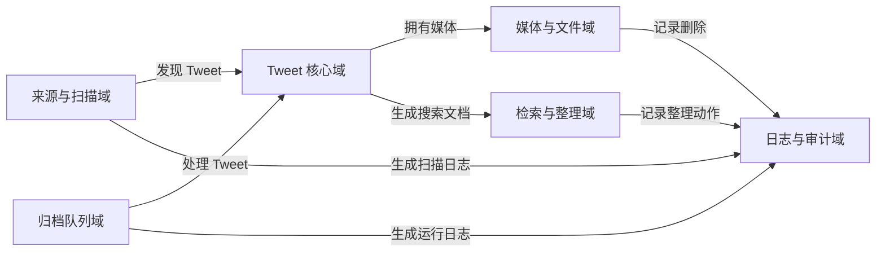
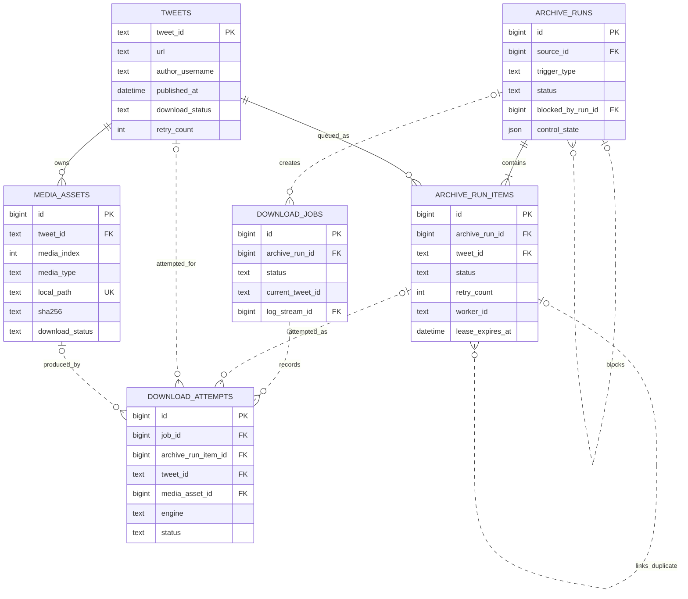
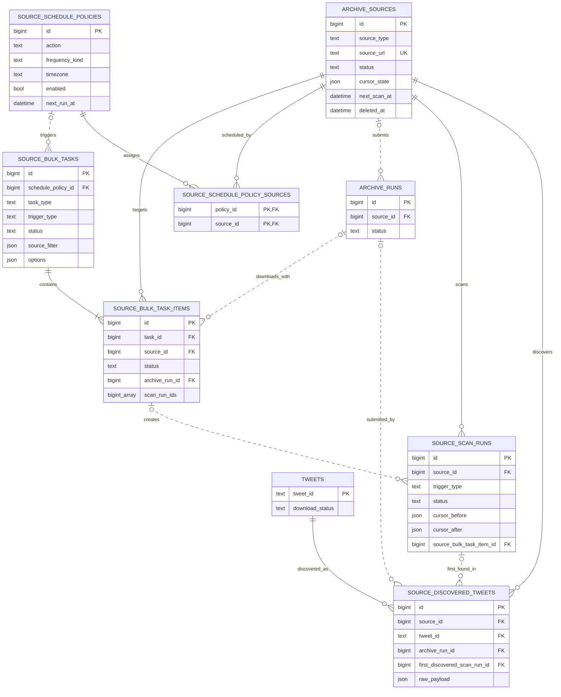
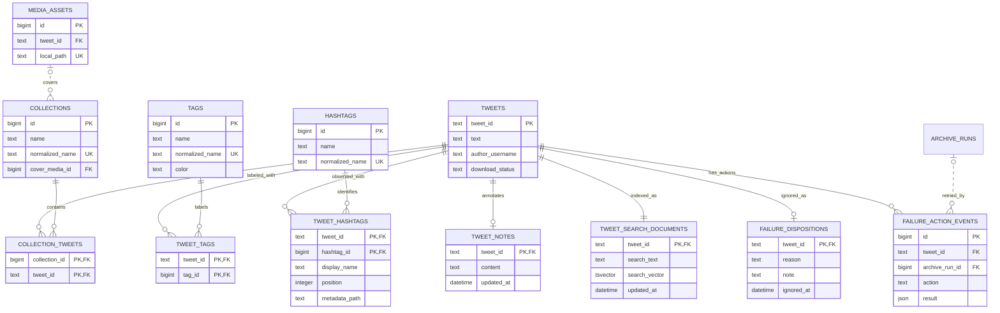
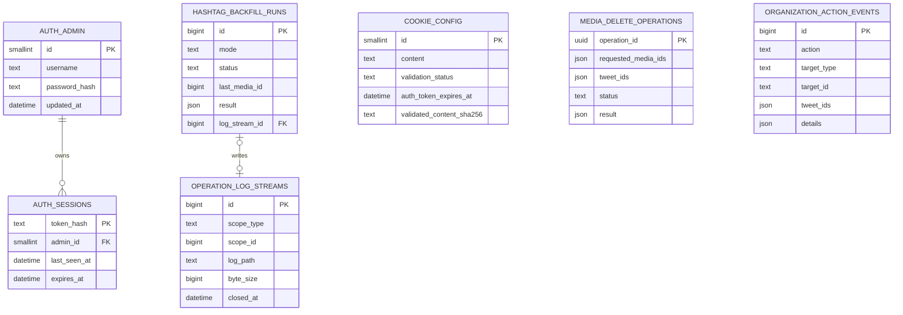

# 核心数据模型

本文按业务域解释 Postgres schema 及其与 `archive/` 文件系统的关系。图中只保留理解所有权、生命周期和查询边界所需的字段；完整列、约束、索引和 trigger 以最新 Alembic revision 为准。

## 1. 数据所有权

系统把数据分成四类：

| 类型 | 持久位置 | 例子 | 权威性 |
| --- | --- | --- | --- |
| 业务事实 | Postgres | Tweet、媒体状态、来源、run、标签、合集 | 状态与关系的最终事实源 |
| 二进制与原始产物 | `archive/` | 媒体、元数据 JSON、预览图、导出文件 | 文件存在性与内容的事实源 |
| 追加式操作日志 | `archive/logs/*.jsonl` + Postgres 摘要 | 来源扫描与下载日志 | JSONL 保存正文，数据库保存索引和统计 |
| 短生命周期投影 | 应用内存与浏览器内存 | EventBroker、Runtime Store、React Query | 可丢弃、可重建，不参与恢复决策 |

Postgres 与文件系统不是相互替代的副本。`media_assets.local_path` 连接两者：数据库说明文件应该在哪里及其校验结果，文件系统提供真实字节。完整恢复业务状态与媒体至少需要同时恢复 Postgres 和 `archive/media/`；日志、原始输入、运行状态与导出物按第 8 节的分级策略处理。

## 2. 业务域总图



`tweets` 是跨域锚点：来源发现、归档 item、媒体资产、失败处置、标签、合集、备注和搜索文档都围绕稳定的 `tweet_id` 关联。媒体文件目录则使用稳定的 `author_id`，用户名只用于展示和搜索。

## 3. Tweet、媒体与归档队列



关键规则：

- 一个 run 内 `tweet_id` 唯一；部分唯一索引还保证同一 Tweet 同时只有一个 active item。
- `archive_run_items` 是 worker 的领取和重试单元；`tweets.download_status` 与 `media_assets.download_status` 是归档结果事实。
- `download_attempts` 记录每个 engine 的尝试；`download_jobs` 汇总一次子进程运行。
- `operation_log_streams.scope_type/scope_id` 是多态逻辑引用。它没有跨多表外键，下载 job 或扫描 run 还可以通过可空 `log_stream_id` 指向日志流；正文由 `log_path` 指向受控的 JSONL 文件。
- 图中的 run 自关联、attempt 可选关联和日志关联使用虚线，表示可为空、删除后可保留历史或由逻辑作用域连接。

## 4. 来源、扫描与批量调度



`source_bulk_task_items.scan_run_ids` 是为了保留一个批量 item 可能跨多个扫描 run 的顺序历史而使用的数组，不是数据库外键。当前实际归属还通过 `source_scan_runs.source_bulk_task_item_id` 表达。

来源删除是软删除：`archive_sources.deleted_at` 隐藏来源但不删除 Tweet、媒体或整理关系。扫描 run 和发现关系用于可追溯性；普通扫描只写发现关系，不隐式创建 `archive_runs`。

## 5. 检索、整理与失败处置



`tags` / `tweet_tags` 是用户可编辑的自定义标签；`hashtags` / `tweet_hashtags` 是从 gallery-dl 已登记落盘元数据观察到的只读平台事实，两者不复用关系或写接口。平台 Hashtag 以 Unicode NFKC + casefold 后的值判重，同时在 Tweet 关系上保留首次观察到的显示写法和顺序。它采用只增不减语义：缺失或空元数据不会删除既有关系。

自定义标签和合集通过连接表形成多对多关系；删除标签或合集只级联删除连接关系。`collections.cover_media_id` 使用 `ON DELETE SET NULL`，所以媒体物理删除不会删除合集。平台 Hashtag 与 Tweet 绑定；删除媒体或软删除来源时继续保留，只有 Tweet 被删除时才随 FK cascade 删除。

`tweet_search_documents` 是每 Tweet 一行的派生投影，聚合 Tweet 正文、作者、自定义标签名、平台 Hashtag、合集名和私人备注。数据库 trigger 在相关事实变化后同步刷新 `search_text`，并由生成列构建 `tsvector`；GIN 全文索引和 trigram 索引共同提供中英文混合检索。它可以从业务事实重建，不是独立的用户数据所有者。

## 6. 认证、配置与追加式审计



- `auth_admin` 是 singleton 管理员；会话只存 token 哈希，修改密码会撤销全部会话。
- `cookie_config` 是 singleton 配置。其 `content` 是敏感凭据，只能由 Cookie service 使用，不能进入普通查询、日志或导出。
- `hashtag_backfill_runs` 记录显式历史维护的 dry-run/apply 模式、批次 checkpoint 和摘要；正文日志通过可空 `log_stream_id` 指向 `operation_log_streams`。它不代表 migration 或应用启动会自动扫描历史文件。
- `media_delete_operations.operation_id` 是客户端提供的幂等键，允许安全重放而不重复删除。
- `organization_action_events` 与 `media_delete_operations` 使用 JSON 保存动作快照，不设置到业务表的外键，避免后续删除反向抹掉审计证据。

## 7. 删除与保留矩阵

| 动作 | 删除内容 | 明确保留 | 状态收敛 |
| --- | --- | --- | --- |
| 软删除来源 | 设置 `deleted_at`，停止并禁用活动扫描会话，取消置顶并清除下次扫描时间 | Tweet、媒体、发现与下载历史、整理信息 | 来源改为 `paused` 并从普通查询隐藏 |
| 删除标签 | 标签及 `tweet_tags` 关系 | Tweet、媒体、其他整理信息 | 搜索投影由 trigger 刷新 |
| 删除合集 | 合集及 `collection_tweets` 关系 | Tweet、媒体、标签、备注 | 搜索投影由 trigger 刷新 |
| 物理删除媒体 | 精确媒体文件、派生预览及对应 `media_assets` 行 | Tweet、来源、run、attempt、自定义标签、平台 Hashtag、合集关系和备注 | 受影响 Tweet 标记为 `missing`，合集封面置空 |
| 删除 Tweet | 当前没有常规用户入口；若维护者直接删除数据库行，FK 会级联删除全部 Tweet 子记录，包括 `media_assets` 行、archive queue items、来源发现关系、download attempts、整理关系、失败处置和搜索投影；run/job 外壳可能继续存在 | `archive/media` 中的文件字节不会被数据库 cascade 删除，必须另行安全处置，否则会形成孤儿文件 | 属于架构外且高风险的维护动作 |

## 8. 文件系统布局

```text
archive/
  media/<author_id>/<tweet_id>/    媒体、下载器元数据、缩略图与视频预览
  logs/source-scan-logs/           来源扫描 JSONL 操作日志
  logs/download-logs/              下载 JSONL 操作日志
  logs/hashtag-backfill/           平台 Hashtag 历史维护 JSONL 操作日志
  raw/imports/                     原始导入留档
  raw/downloader_inputs/           下载器 scoped 输入
  state/                           下载器运行时 Cookie 副本与其他本地状态
  exports/                         CSV 或静态图库导出
```

备份分级：Postgres 与 `archive/media/` 是完整恢复业务状态和媒体字节的必需集合；`archive/logs/` 和 `archive/raw/` 用于保留诊断与原始输入，可按保留策略选择；`archive/state/` 只在确实需要延续下载器状态时纳入，并须将其中运行时 Cookie 副本按凭据保护；`archive/exports/` 可从数据库重建。

路径约束：

- 媒体主目录使用稳定 `author_id`，不使用可能变化的用户名。
- `media_assets.local_path` 和 `metadata_path` 的现有记录可能是绝对路径或相对路径。对外媒体响应会转换为归档相对路径并由文件路由校验 `archive/` 边界；物理删除会独立兼容两种格式，并施加更严格的 `archive/media` 边界。
- 物理删除进一步限制在 `archive/media` 内，并按数据库 ID 解析确切文件集合。
- 操作日志的路径由服务端生成，读取时再次校验仍位于 `archive/`；当前媒体删除比普通日志读取采用更严格的 `archive/media` 边界。

## 9. Schema 变更规则

1. 只新增 Alembic revision，不修改已发布 migration。
2. migration 的 upgrade 和 downgrade 都要验证；Postgres 扩展若可能被共享，downgrade 不应贸然卸载。
3. `cli/xarchiver/tables.py` 是共享查询元数据，不是 schema migration 的替代品；它可只声明业务代码需要的列。
4. 新增跨域关系时必须明确 `CASCADE`、`SET NULL` 或 `RESTRICT` 的原因。
5. 可重建投影与不可恢复用户数据应在命名和文档中区分，备份策略也应不同。

## 10. 相关文档

- [系统架构总览](system-overview.md)
- [可靠性与一致性设计](reliability-and-consistency.md)
- [来源扫描工作流](source-scanning-workflow.md)
- [下载器契约](downloader-contract.md)
- [部署与备份恢复](../deploy/README.md)
