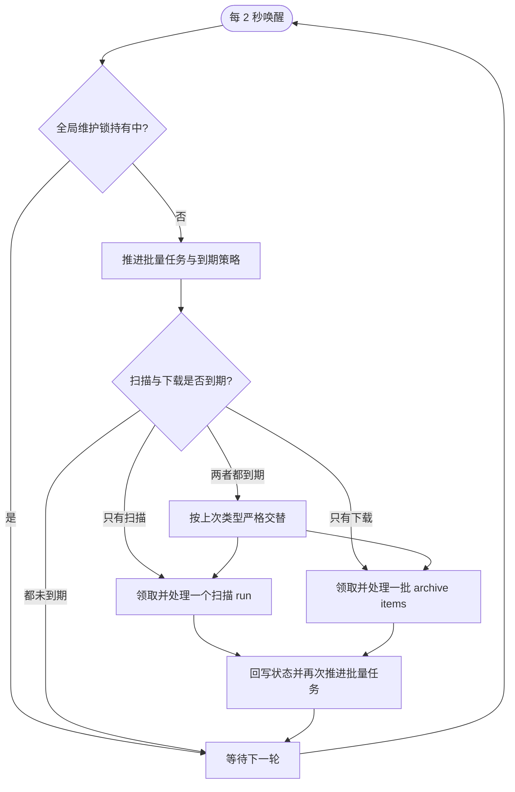
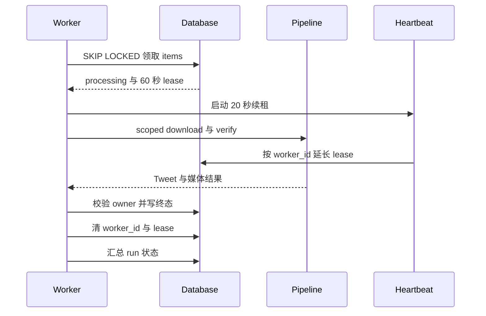
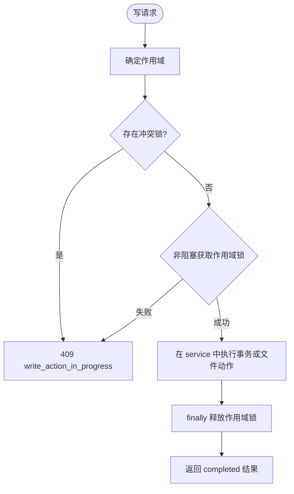
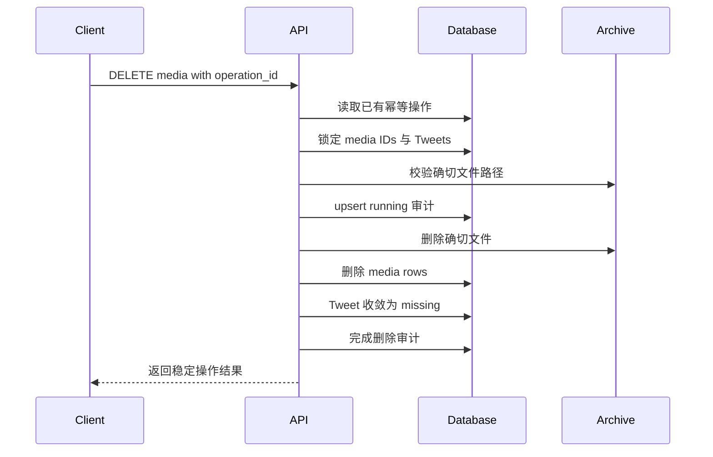

# 可靠性与一致性设计

本文解释 `x-media-archiver` 如何在单应用实例、本地文件系统和 Postgres 环境下处理重复提交、长任务、并发写、进程中断、实时消息丢失和跨数据库/文件系统操作。

## 1. 一致性模型

系统不追求跨所有组件的分布式强一致，而是按数据性质选择机制：

| 范围 | 一致性机制 | 目标 |
| --- | --- | --- |
| 单个数据库事务 | 行锁、唯一约束、FK、trigger | 原子更新关系与状态 |
| 部分精确 Tweet 写路径 | Postgres advisory transaction lock | 串行化队列提交、失败处置和来源失败重试等已接入路径 |
| 队列领取 | `FOR UPDATE SKIP LOCKED` + worker lease | 避免重复领取，并允许故障后接管 |
| 需要互斥的 API 写操作 | 进程内作用域锁 | 尽力抑制单实例内冲突的人工动作并行执行 |
| 数据库与文件系统 | 幂等键 + 审计 + 校验 | 处理可捕获失败，并暴露仍需重试或人工处置的崩溃窗口 |
| 实时 UI | snapshot + epoch/sequence + query invalidation | 消息可丢，但页面最终回到数据库事实 |

这些机制以单实例部署为前提。进程内作用域锁不能替代跨实例分布式锁；如果未来运行多个主动应用实例，必须先完成新的调度和事件架构设计。

## 2. 网络工作调度

应用 lifespan 只启动一个 `archive-network-worker`。它在**后台历史/计划扫描与 archive queue 下载**之间公平调度，避免这两类后台任务彼此并发执行。



调度公平性有两层：

- 扫描与下载同时就绪时，根据 `last_kind` 交替，避免一种工作长期饥饿。
- 下载队列按 run 的 `last_dispatched_at` 选择候选 run，再从该 run 领取一个 batch，避免大型 run 长期独占 worker。

这不是全进程网络互斥锁。即时 `POST /sources/{id}/scan` 和 Cookie 检测在 API 请求线程直接执行，`xarchiver sources scan`、`xarchiver download` 和 `xarchiver retry` 也在独立 CLI 进程直接启动外部工具，都会绕过后台 worker。Cookie 检测只有自己的进程内锁，不能与扫描或下载互斥。运维时不得在后台任务活跃期间并行执行这些旁路；如果产品需要全入口强制串行，必须另行实现跨入口、跨进程的所有权机制。

## 3. 归档队列领取与租约

### 3.1 提交幂等

提交 run 时：

- run 内相同 `tweet_id` 去重。
- 已 `verified` 的 Tweet 生成 `skipped_verified` item。
- 已被其他 active item 处理的 Tweet 生成 `linked_pending` item。
- 失败处置为 ignored 的 Tweet 生成 `skipped_ignored` item。
- 来源已有前序 active run 时，新 run/item 进入 `blocked`，前序 run 终止后才释放。

数据库部分唯一索引保证同一 Tweet 不会同时存在两个 active item；应用层统计则把“跳过”和“链接”保留在新 run 中，确保每次用户提交都有可审计结果。

### 3.2 原子领取

worker 使用单条 CTE 更新领取 item：

```text
选择候选 run
  -> SELECT ... FOR UPDATE SKIP LOCKED
  -> 选择该 run 的到期 items
  -> UPDATE status=processing, worker_id, lease_expires_at
  -> RETURNING claimed rows
```

领取事务提交后，`ArchiveItemLeaseHeartbeat` 每 20 秒续租，租约默认 60 秒。pipeline 返回后会再次校验 lease，archive item 的终态更新也带 `worker_id` 条件；若续租失败或 owner 已改变，抛出 `WorkerLeaseLost`，旧 owner 不会提交该 item 的终态。



如果 pipeline 抛出非租约异常，当前 items 会收敛为 `failed_retryable` 或达到重试上限后的 `failed_permanent`，并设置退避时间；取消请求优先收敛为 `cancelled`。

lease fence 不覆盖整个下载 pipeline：外部工具写文件、媒体回填以及 Tweet/media 校验状态可能在返回并检查 lease 之前已经发生。若此时旧 owner 丢失 lease，这些文件和事实写仍可能保留；后续 owner 依靠下载幂等、媒体 upsert 和 verify 收敛，而不是假设旧 pipeline 没有产生任何结果。

### 3.3 重试与退避

可重试 item 只有在 `next_attempt_at <= now()` 后才重新领取。每次失败增加 `retry_count`，退避分钟数为配置基数乘当前重试次数；达到 `RETRY_LIMIT` 后进入永久失败。

人工“失败重试”不是原地清空历史，而是创建新的 `manual_retry` run 并追加 `failure_action_events`。这保留了原失败和处置时间线。

## 4. 来源扫描领取与 cursor 安全

由后台 worker 管理的来源扫描使用 worker owner、lease 和 heartbeat；即时 API/CLI 旁路以 `worker_id=None` 运行，不会启动 lease heartbeat。无论入口如何，一次扫描 run 都在成功解析并持久化整个批次后，才把 `cursor_after` 提升为下一次 checkpoint；认证失败、限流和网络错误不会推进 cursor。

扫描的关键顺序是：

```text
选择到期来源并创建带 owner/lease 的 scan run（即时旁路不带 owner/lease）
  -> 启动 gallery-dl
  -> 有界读取 stdout/stderr
  -> 独立提交 Tweet 幂等 upsert
  -> 事务内幂等写发现关系与来源汇总
  -> 写 batch 计数和 cursor_after
  -> 关闭操作日志流
  -> 收敛来源会话与批量 item
```

部分精确写路径会使用每 Tweet advisory lock：队列提交、失败处置和来源失败重试在同时需要 Tweet 行锁时先取 advisory lock，再取行锁。普通来源发现通过幂等 upsert 写入，不取得该 advisory lock；媒体删除则先锁 `media_assets` 行，再按 Tweet 取得 advisory lock，且不锁 Tweet 行。因此当前实现不存在覆盖所有来源写与媒体删除的统一锁序保证，变更这些路径时必须单独审查交叉事务和死锁风险。

更详细的三种扫描会话、错误状态和批量任务状态机见 [来源扫描工作流](source-scanning-workflow.md)。

## 5. API 写操作并发控制

需要抑制冲突的 API 写操作使用 `execute_write_action` 检查并非阻塞地获取进程内作用域锁。检测到已持有的冲突锁时返回 `409 write_action_in_progress`，让用户明确重试。冲突检查与实际获取不同作用域锁不是一个原子步骤，因此 global 与细粒度请求同时进入时仍存在竞态；这是一层尽力型操作保护，不是数据正确性边界。普通资源写入也并非全部经过该入口，它们依靠事务、唯一约束、行锁或 service 自身的并发规则。



当前作用域包括：

- `global`：全量维护、媒体物理删除、失败处置、通用 requeue/recover/export 等。
- `sources`：来源排序、批量任务和定时策略配置。
- `source:<id>`：单来源删除或即时扫描。
- `library-organization`：标签、合集、备注和批量整理。

在一个锁已成功持有后，`global` 检查会拒绝已持有的细粒度作用域，细粒度检查也会拒绝已持有的 `global`；相同细粒度作用域由同一把锁串行化，不同细粒度作用域可并行。由于前述检查/获取竞态以及进程边界，数据库唯一约束、advisory lock 和行锁才是数据正确性的最终防线。

## 6. 外部子进程生命周期

下载与扫描中的 gallery-dl、yt-dlp 遵循相同的有界生命周期原则：

- stdout/stderr reader 只解析并写入有界队列，主线程是操作日志的唯一 writer。
- 内存只保留固定大小的 stdout/stderr 尾部，避免长任务无限增长。
- 进度写入节流；终态、错误、取消和停止立即持久化。
- reader、解析、日志或数据库写入失败时，owner 负责终止整个进程组。
- 正常退出也必须在统一 deadline 内 drain reader 与待写日志；超时视为失败。
- Compose 的 `init: true` 负责回收进程组强杀后遗留的孙进程。

操作日志先写 JSONL 文件，再在持有数据库行锁时同步摘要。检测到崩溃窗口造成文件大小与 DB `byte_size` 不一致时，以 JSONL 文件重建摘要；事务提交结果不确定时不盲目截断文件，而是在新连接中重新校准。

视频预览使用另一条、更短的 ffmpeg 路径：每次以 `subprocess.run(capture_output=True)` 同步执行，设置单次 timeout，成功后原子替换临时预览文件，并在 `finally` 清理临时文件。它不使用上述有界 reader、operation log writer、进程组或 drain deadline 机制。

## 7. 跨数据库与文件系统的媒体删除

数据库事务无法原子回滚已经删除的文件，因此媒体删除使用“幂等操作记录 + 精确目标 + 明确收敛”的设计：

1. 客户端生成 `operation_id`，后端先读取已有 `media_delete_operations`；已完成操作直接返回结果。
2. 按 `media_assets.id` 锁定目标，并为每个 Tweet 获取 advisory lock。
3. 校验主文件、元数据、缩略图和视频预览都位于 `archive/media`，随后在当前、尚未提交的数据库事务中把操作审计 upsert 为 `running`。
4. 删除确切文件并清理空目录，不使用目录通配符。
5. 删除对应 `media_assets` 行，将受影响 Tweet 标记为 `missing`。
6. 把成功、缺失、错误和受影响 Tweet 写入操作结果。
7. 同一 `operation_id` 在已完成后重放时返回既有结果；捕获到文件系统 `OSError` 时会提交 `failed` 和部分删除统计，可用同一 ID 重试。



删除保留 Tweet、来源发现、run、下载尝试、标签、合集成员关系和备注。合集封面 FK 使用 `SET NULL`，不会因媒体删除而删除合集。

这里仍有不可自动恢复的崩溃窗口：`running` 审计、媒体行更新和最终审计在同一数据库事务里提交，但文件 `unlink` 发生在提交之前。若进程在删除部分文件后直接崩溃，数据库事务会回滚，甚至不会留下 `running` 记录。当前启动流程不会扫描并修复这种情况；需要客户端保留原 `operation_id` 重试，或通过 `verify` 发现缺失文件后人工处置。

## 8. 启动恢复与故障收敛

FastAPI lifespan 在启动 worker 前执行三类检查或恢复：

- 统计过期的 archive item lease 并告警，但不在启动阶段修改这些行；后续 `claim_next_items()` 会把过期的 `processing` item 作为候选并原子覆盖 owner 与 lease。
- 把上次进程遗留的活动扫描 run 收敛为失败并关闭对应日志流。
- 清理过期扫描 lease，使合法的扫描会话可以继续。

CLI 还提供显式 `recover-interrupted`，按超时阈值恢复遗留的下载 job、Tweet 和 run 状态。恢复不删除历史 attempt 或日志，而是让未完成状态回到可诊断、可重试的状态。

上述扫描恢复和 archive lease 检测发生在新 worker 领取前。恢复与告警不得记录 Cookie、生产连接串或完整外部工具命令中的敏感参数。

## 9. 实时通道的最终一致性

EventBroker 是进程内有界通道，不做持久 replay。只读 Runtime WebSocket 通过以下机制保证 UI 可恢复：

- 每个应用进程有独立 `epoch`；重启后 epoch 变化。
- broker 使用全局 sequence，单连接使用 `connection_sequence` 检测丢包。
- 首帧和每 60 秒发送持久事实 snapshot；普通事件在 200ms 窗口合并为 patch。
- 每连接有界队列溢出时发送 `system.resync_required`，随后重新快照。
- WebUI 只在成功应用首帧 snapshot 后认为 WebSocket 已连接。
- WebSocket 不可用时切换为 REST snapshot 轮询；任意时刻只有一个 transport 写 Runtime Store。
- 终态与资源边界事件触发 React Query 失效，最终由 REST/DB 快照完成收敛。

因此实时事件允许重复、合并、延迟或丢失；任何业务正确性都不能依赖“某条 WebSocket 消息一定到达”。详细协议见 [WebUI 实时运行态](runtime-realtime-evolution.md)。

## 10. 审计与可观测性

系统保留四类互补证据：

| 证据 | 用途 | 保存内容 |
| --- | --- | --- |
| run/item/attempt 表 | 归档任务生命周期 | 状态、重试、错误分类、worker 与进度 |
| source scan/bulk 表 | 来源发现与计划执行 | cursor、批次计数、扫描/下载关联 |
| operation log JSONL | 外部工具诊断 | 脱敏后的 stdout/stderr 与级别 |
| action audit 表 | 高价值人工动作 | 删除、失败处置、标签/合集/备注变化 |

日志与审计遵守最小暴露原则：Cookie 正文、会话 token、生产连接串不写入；私人备注的整理审计只记录存在性或长度等必要元数据，不复制正文。

## 11. 已知限制与扩展触发器

当前可靠性机制不等价于分布式系统支持：

- 进程内锁无法协调两个应用实例。
- EventBroker 不能跨进程广播，也不能持久 replay。
- 本地 `archive/` 假设单一共享文件系统视图。
- Cookie singleton 假设单管理员、单账号上下文。

需要横向扩展时，至少应先设计：数据库级调度 owner、跨实例锁、外部 pub/sub、对象存储或共享文件原子语义、集中日志、加密密钥和租户隔离。未经这些改造，不能只靠增加 Compose replica 扩容。

## 12. 验证要求

涉及以下内容的变更必须补定向测试，并按项目基线运行完整验证：

- queue/run/item 状态迁移、重试预算或租约。
- 来源 cursor、扫描错误恢复、批量任务控制。
- 文件路径、媒体删除、日志写入或进程终止。
- migration、外键删除策略、搜索 trigger。
- WebSocket epoch/sequence、snapshot 或 transport 切换。

真实 X/Twitter 请求只在用户明确授权的受控验收中执行；自动化测试使用隔离数据库、模拟 subprocess 和合成媒体文件。

## 13. 相关文档

- [系统架构总览](system-overview.md)
- [核心数据模型](data-model.md)
- [下载器契约](downloader-contract.md)
- [来源扫描工作流](source-scanning-workflow.md)
- [工程 CI 与测试隔离](../testing/engineering-ci-and-test-isolation.md)
- [部署与备份恢复](../deploy/README.md)
