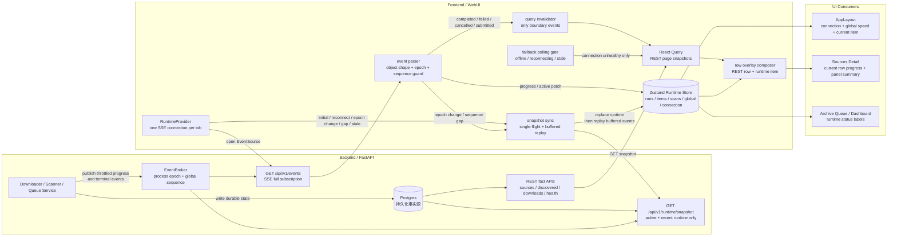
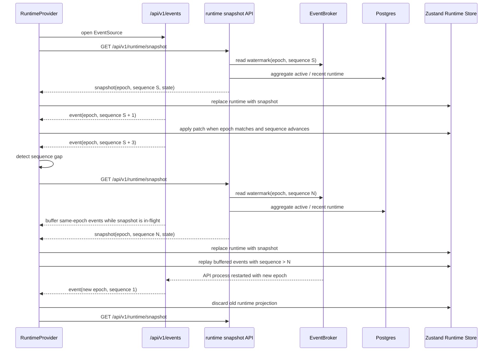

# WebUI 实时运行态演进计划

本文定义 WebUI 下载、扫描与后台 worker 状态的长期实时化演进方案。目标不是把所有 REST API 改成 WebSocket，而是把当前页面级轮询逐步收敛为“持久化快照 + 实时运行态投影 + 行级 overlay”的客户端式体验。

## 1. 背景与目标

当前 Sources 详情页依赖多个 REST query 与固定轮询刷新：

```text
GET /api/v1/health/detail
GET /api/v1/sources/{source_id}
GET /api/v1/sources/{source_id}/downloads
```

同时 WebUI 已通过 `/api/v1/events` 建立 SSE 连接，但当前事件主要用于 invalidate React Query，再触发 REST 重新拉取。这个模式能保持页面可用，但对下载系统来说过于粗糙：

- 下载进度依赖高频 REST 轮询，状态延迟和请求量都不可控。
- 下载、扫描运行态绑定在 Sources 详情 tab 内，切到其他页面后全局感知弱。
- SSE 和 REST 缺少明确分工，容易形成“事件来了也重新扫接口”的双重刷新。
- 如果后续直接上 WebSocket command，容易把实时层做成第二套业务系统。
- 当前多个页面分别调用 `useServerEvents` 会建立多条 EventSource；每条 SSE 订阅在后端通过 `asyncio.to_thread(subscription.get, 15.0)` 占用默认 executor 线程，多页面与多 tab 会放大连接和线程成本。

长期目标：

- 任意页面都能看到全局下载、扫描、worker 与队列状态。
- Sources 详情列表中的当前下载项、失败项、暂停项能实时更新，不靠整页高频刷新。
- REST 继续负责资源快照、分页、筛选、历史记录与脚本兼容。
- SSE / WebSocket 只负责短生命周期运行态投影与命令回执。
- 实时连接可以随时断开；断线不影响业务正确性，重连后通过 snapshot 收敛。

## 2. 核心边界

### 2.1 事实源分层

必须保持以下边界：

```text
DB
  持久化事实源。archive_runs、archive_run_items、source_scan_runs、download_jobs、
  media_assets、operation_logs 等表决定业务最终状态。

REST
  事实快照层。负责列表、分页、筛选、详情、历史和兼容调用。

Runtime Store
  短生命周期运行态投影。只保存 active、recently changed、command pending 等状态。

Overlay
  UI 增强层。把实时 item/run 状态叠加到 REST 列表行上，不能成为持久事实源。

SSE / WebSocket
  运行态更新通道。可以丢、可以断、可以重连，不允许成为唯一事实来源。
```

不得把完整 discovered 列表、完整历史 run 列表或完整队列搬入 Runtime Store。否则前端会变成第二套数据库，后续分页、筛选、恢复和一致性都会返工。

### 2.2 列表行实时更新模型

Sources 详情 tab 的列表不能只依赖全局下载摘要。真实下载器应按以下方式合成行状态：

```text
REST page snapshot
  GET /api/v1/sources/{source_id}/discovered
  GET /api/v1/sources/{source_id}/downloads

+ Runtime item overlay
  keyed by archive_run_item_id
  secondary index: tweet_id -> active archive_run_item_id

= Rendered row state
```

内部主键必须优先使用 `archive_run_item_id`。`tweet_id` 只能作为来源详情页查找当前 active item 的辅助索引，因为同一个 Tweet 可能被重试、重新下载、出现在不同 run 中。

终态事件必须双写 UI 与持久化收敛：

```text
progress event
  patch overlay only

completed / failed / cancelled / stopped / retried event
  patch overlay
  invalidate affected REST queries
```

这样列表能即时变化，刷新页面或切换筛选后仍以数据库快照为准。

### 2.3 状态生命周期

Runtime Store 只保存有限生命周期状态：

- 活跃 run、活跃 scan、活跃 item。
- 最近完成、失败、取消、停止的 run/item，保留 30 - 120 秒用于 UI 过渡和提示。
- 当前连接状态、重连状态、命令 pending 状态。
- 最近少量 activity event，不替代 operation log。

重连后以服务端 snapshot 覆盖 runtime。snapshot 不包含的非活跃 overlay 必须清理。

### 2.4 状态语义拆分

不得用一个 `status` 表达所有层级。至少要区分：

- `run.status`：archive run 生命周期，例如 queued、running、paused、blocked、completed、failed、stopped。
- `item.status`：archive run item 生命周期，例如 pending、processing、completed、failed、cancelled。
- `job.status`：download job / downloader subprocess 状态。
- `worker.status`：worker 当前是否持有写锁、是否正在执行。
- `command.status`：前端命令是否 pending、accepted、rejected、completed、failed。

命令回执不等于业务终态。例如 `command.accepted` 只表示后端已接受命令；下载是否开始必须由 `download.run.started`、snapshot 或对应 run 状态确认。

阶段一现有代码没有稳定的 worker topic publish。`worker.status` 第一版只能来自 `/api/v1/runtime/snapshot` 或统一的 health 聚合；如果需要事件驱动 worker 状态，必须先新增显式 worker 事件。

## 3. 两阶段实施计划

### 阶段一：SSE 提取与轮询收敛

目标是在不引入 WebSocket command 的前提下，先建立运行态抽象，降低页面级轮询。

后端：

- 继续使用现有进程内 `EventBroker` 和 `/api/v1/events` SSE。
- 为事件 envelope 增加进程级 `epoch`。前端发现 epoch 变化时必须丢弃旧 runtime 并请求 snapshot。
- 新增 `GET /api/v1/runtime/snapshot`，聚合 active runs、active/recent items、active scans、worker、queue 和连接所需元信息。
- 补齐关键事件 payload，使前端能定位 run/item/source：
  - `source_id`
  - `archive_run_id`
  - `job_id`
  - `run.status`
  - `run.speed_bps`
  - `items[]`
  - `items[].archive_run_item_id`
  - `items[].tweet_id`
  - `items[].status`
  - `items[].downloaded_bytes`
  - `items[].total_bytes`
  - `items[].speed_bps`
  - `progress_message`
  - `updated_at`：仅用于展示。不得参与事件新旧判断、排序或 overlay merge，理由见 4.3。
- 下载进度节流必须做在 downloader 采样层，而不是只在 broker 或前端做：
  - 同一 run/item 500ms - 1000ms 内只执行一次进度 DB 写入和 publish。
  - 每个 item 的首次进度必须立即 flush，不能被节流窗口吞掉。
  - current item 切换时必须强制 flush 前一个 item 的最后一次采样，再开始下一个 item 的节流窗口。
  - 终态、错误、取消、停止事件立即写入和发送，不被 progress 合并吞掉。
  - 避免把每一行 `gallery-dl` / `yt-dlp` 输出都变成一次 `connect()`、`update`、`commit` 和 SSE publish。
- 节流状态必须按 job 维护并跨所有进度入口共享，不能在各 call site 各自实现：
  - 现有进度入口有三个，其中两个并发：`yt-dlp` 原生解析路径、`gallery-dl` 事件路径（两者都跑在 stdout / stderr 两个 `read_stream` 线程里），以及主循环的 fallback 文件大小采样。
  - 三个入口各自节流会让实际频率变成窗口的 2 - 3 倍，7 节的频率验收必然不通过。
  - 状态应挂在 `DownloadProgressState` 上，并由已有的 `state_lock` 保护。
- 保留现有 REST 写入口，不迁移 command。

前端：

- 新增根级 Runtime Provider，在 App 启动时建立一条统一 SSE 连接，并替代各页面自行建立 EventSource。
- 阶段一 runtime SSE 连接不得传 `topics`，必须订阅全部事件。当前 broker 的 sequence 是全局自增，topic 过滤会让部分订阅者天然看到跳号，从而误触发 gap resync。
- 新增 Runtime Store，保存全局摘要、active run/scan、item overlay、command pending、连接状态。
- `useServerEvents` 从“全局 invalidate 器”逐步改为“事件 -> runtime patch + 必要 query invalidate”。
- 首次连接、重连、epoch 变化、sequence gap 或 stale 恢复后，请求 `/api/v1/runtime/snapshot` 覆盖 runtime。
- `/api/v1/sources/{source_id}/downloads` 改为快照接口：
  - 首次打开来源详情或切换来源时请求。
  - SSE connected 时不固定 3 秒轮询。
  - SSE offline/reconnecting/stale 且来源详情面板打开时，启用 3 秒降级轮询；不要只依赖 runtime 的 `hasActiveDownload`，因为断线期间它可能已经过期。
- `/api/v1/health/detail` 由 AppLayout 或 Runtime Provider 统一查询，Sources 页不再额外重复拉取。
- Sources 详情列表渲染时合并 REST row 与 item overlay。
- 顶栏或底部状态条展示全局下载速度、当前下载项、当前扫描来源、连接状态与队列摘要。

阶段一完成后，WebUI 即使没有 WebSocket，也应具备“全局可见 + 行级进度 + 断线降级”的下载器体验。

### 阶段一流程架构图

阶段一的核心分工是：DB / REST 继续提供持久化事实，`/api/v1/events` 只推运行态增量，`/api/v1/runtime/snapshot` 负责首连和异常恢复，前端用 Zustand Runtime Store 做细粒度投影，React Query 只在初始快照、终态收敛和降级场景中请求 REST。



关键约束：

- `archive.run.progress`、`operation.log.appended` 等高频事件只 patch Runtime Store，不触发 Sources / discovered / health 的 REST 刷新。
- 完成、失败、暂停、恢复、提交等边界事件先 patch runtime，再 invalidate 受影响的 REST query，让数据库快照完成最终收敛。
- 来源详情页在 SSE `connected` 时不固定轮询；只有 `offline`、`reconnecting`、`stale` 时才启用降级轮询。
- Runtime Store 只保存 active / recent 运行态，不接管完整列表、分页、筛选和历史事实。

snapshot 水位与事件回放流程：



### 阶段二：WebSocket Runtime Channel

目标是在阶段一边界稳定后，引入双向 runtime channel，承载 snapshot、patch、event 与 command。

新增接口：

```text
GET /api/v1/runtime/ws
```

服务端到前端消息：

```text
snapshot
  完整运行态。连接成功、重连恢复、sequence 不连续时发送。

patch
  下载、扫描、worker、队列的增量变化。支持 batch。

event
  面向 activity feed / toast / 日志入口的人类可读事件摘要。

command.accepted / command.rejected / command.completed / command.failed
  命令回执。
```

前端到服务端消息：

```text
command
  带 client_command_id 的控制命令。
```

首批 WS command：

- `source.scan.start`
- `source.scan_session.pause`
- `source.scan_session.resume`
- `source.scan_session.stop`
- `source.download.submit`
- `archive.run.pause`
- `archive.run.resume`
- `archive.run.stop`
- `archive.run.items.cancel`

命令命名必须对齐现有 service 边界。例如现有扫描暂停、恢复、停止是来源扫描会话级操作，而不是单个 scan run 级操作，因此命令名使用 `source.scan_session.*`。

REST 写接口必须保留，并与 WS command 调用同一批 service 或同一层 command handler。不得让 WS 绕过现有鉴权、写锁、错误映射和审计语义。

WebSocket handler 必须显式做鉴权与 Origin 校验：

- 当前 HTTP 鉴权使用 `BaseHTTPMiddleware`，只处理 HTTP scope，不能保护 WebSocket 握手。
- WS handler 必须读取 `SESSION_COOKIE` 并调用与 HTTP 相同的 session 校验逻辑。
- 认证失败或 Origin 不合法时关闭连接，close code 使用 `1008`。
- Origin 校验必须复用 HTTP 写请求的同源与本地开发白名单语义。
- `auth_mode=disabled` 时才允许跳过鉴权，但仍应记录警告日志。

WS 稳定后，前端优先使用 WS runtime channel。SSE 可保留为兼容或降级通道；REST 降级轮询继续作为长连接不可用时的兜底。

## 4. 协议与一致性规则

### 4.1 消息 envelope

运行态消息必须包含 epoch 与 sequence：

```json
{
  "type": "download.items.patch",
  "epoch": "2f4f4c0d8e7b4f0fa1c2c7b0e2d7f3d1",
  "sequence": 1024,
  "payload": {},
  "created_at": "2026-07-30T12:00:00Z"
}
```

前端只应用同 epoch 内 sequence 更新的消息。发现 epoch 变化、sequence 不连续、乱序或 patch 无法匹配当前 snapshot 时，进入 `resyncing` 并请求 snapshot。

原因：

- 当前 `EventBroker` 的 `_next_id` 是进程内内存计数，API 进程或容器重启后会从 1 重新开始。
- 如果前端只比较 sequence，新进程的事件会小于旧进程 sequence，导致前端永久丢弃新事件。
- epoch 必须在 API 进程启动时生成。epoch 变化时，前端必须进入 `resyncing` 并重新获取 runtime snapshot。
- 同 epoch 内 sequence 跳号表示事件可能丢失，例如订阅队列满时丢弃最旧事件；前端必须触发 snapshot 收敛。

v1 不做持久化 event replay。容器重启、API 进程重启、队列溢出或网络断线后，通过 snapshot 恢复一致性。

SSE 帧仍会带 `id:` 行，浏览器 EventSource 重连时会自动携带 `Last-Event-ID` 请求头。服务端必须显式忽略这个头，不做断线期间事件补发；重连一律走 snapshot 收敛。`id:` 只用于调试和日志关联，不构成 replay 契约。

### 4.2 Snapshot 粒度

runtime snapshot 只包含运行态，不包含所有历史数据：

- `epoch` 与 `sequence` 水位。
- active / blocked / paused / recently changed runs。
- active / recently changed items。
- active scans。
- worker、queue、download speed、connection-relevant state。
- 少量 recent activity。

页面列表、历史记录、筛选结果仍由 REST query 拉取。

服务端 recent 窗口第一版固定为 **120 秒**，且必须 ≥ 2.3 定义的客户端终态保留窗口（30 - 120 秒）。

这个约束不能省。2.3 要求「snapshot 不包含的非活跃 overlay 必须清理」，如果服务端窗口比客户端保留窗口窄，每次 resync 都会抹掉刚完成、刚失败的过渡态。而 resync 恰好发生在容器重启、sequence gap、stale 恢复这些时刻，正是用户最需要看到「刚刚发生了什么」的时候。两个窗口必须一起改，不能单独调其中一个。

snapshot 聚合必须按固定顺序执行：

```text
1. 读取 broker 当前 epoch 与 sequence 水位 S。
2. 聚合数据库中的 runtime snapshot。
3. 返回 { epoch, sequence: S, ...state }。
```

这个顺序不能反。先取水位再读库，可以保证 `sequence <= S` 的事件已经反映在 snapshot 或比 snapshot 更旧，前端可安全丢弃。前端在请求 snapshot 期间应缓冲同 epoch 事件；snapshot 返回后丢弃 `sequence <= snapshot.sequence` 的缓冲事件，其余事件按 sequence 顺序应用。

水位协议要求 envelope 的 `sequence` 与 snapshot 返回的 `sequence` 处于同一坐标系，即 broker 的全局自增计数。这一点是硬约束，任何后续改动都不得把 envelope 的 `sequence` 换成订阅局部序号，否则 `sequence <= S` 的比较会静默失效（详见 6 节的演进约束）。

snapshot 期间的事件缓冲必须有上界：

- 缓冲上限第一版取 **500 条**。
- 超过上限即放弃缓冲，直接以返回的 snapshot 覆盖 runtime，并标记需要再做一次 resync。
- 目的是避免 snapshot 请求变慢或挂起时缓冲无界增长。

snapshot 请求必须在前端限流与去重：

- 同一 Runtime Provider 同时只允许一个 snapshot 请求在途。
- 连续 resync 触发时最小间隔不低于 2 秒。
- epoch 变化可立即打断等待并发起新 snapshot，但仍保持单飞。

### 4.3 Progress 与终态优先级

终态优先级高于 progress：

```text
completed / failed / cancelled / stopped
  不得被旧 progress 改回 processing。
```

overlay 必须保存 per-item `lastSequence`。同 epoch 内，低于或等于该 item `lastSequence` 的 patch 必须丢弃。终态 patch 应设置 terminal 状态，并在下一次 snapshot 或 epoch 变化前视为不可被 progress 覆盖。

不要用 `updated_at` 判断事件新旧。Postgres `now()` 是事务开始时间，不等同于提交顺序；进度写入来自不同线程的独立事务，提交顺序可能和 `updated_at` 相反。

同一个 Tweet 产生新的 `archive_run_item_id` 后，旧 overlay 不再参与当前行合并。

`tweet_id -> active archive_run_item_id` 辅助索引发生冲突时，第一版按最大 `archive_run_item_id` 选择当前 active item；如果 snapshot 明确标记 active run/item，则 snapshot 优先。

overlay 合并必须区分“字段缺失”和“字段归零”。当前下载进度写入路径可能把非当前 item 的 downloaded、total、speed 写为 0；前端不得把无关 item 的 0 值误认为真实进度回退。进度 patch 应优先使用 `items[]` 中显式定位到的 item 字段。

后端也必须避免把“非当前 item”写成假 0。`archive_run_items.downloaded_bytes`、`total_bytes`、`speed_bps` 是 REST 快照事实的一部分，不能依赖前端 overlay 隐藏错误值。进度写入规则：

- 参数为 `None` 表示该字段不变。
- current item progress 只更新当前 item，其他 item 保留原值。
- explicit terminal batch update 可以对目标 item 写入 0，例如下载器未产出文件、整批失败或明确清零速度。
- `speed_bps` 如需清零，只清当前 item 或终态目标 item，不因“不是当前 item”而清零。

### 4.4 缺失 total 与速度归属

下载器可能拿不到总大小，或 total 从 estimate 变为准确值。UI 必须支持：

```text
determinate progress
  有 downloaded_bytes 和 total_bytes。

indeterminate progress
  只有 downloaded_bytes、speed_bps 或 progress_message。
```

速度要分清：

- item speed：当前 item / 文件速度。
- run speed：当前 run 总速度。
- global speed：所有下载器合计速度。

当前单 worker UI 可以只展示一个 active run，但类型设计不得假设永远只有一个下载或扫描。

现有 `speed_bps` 在部分路径中已经是多个 tweet 的合计值。阶段一补 payload 时必须明确字段归属，例如：

- `item.speed_bps`
- `run.speed_bps`
- `global.speed_bps`

若某层级无法可靠计算，字段应省略，不要复用其他层级速度。

### 4.5 错误与阻塞

错误态是一等状态。runtime patch 应能表达：

- `blocked_reason`
- `error_category`
- `retry_at`
- `requires_user_action`
- `last_error_message`

UI 可以用 runtime 提前禁用按钮或提示风险，但业务判断必须以后端返回为准。例如开始下载时即使 runtime 显示空闲，后端仍可能返回 409。

### 4.6 日志与进度分离

结构化 progress event 给机器消费，允许覆盖和合并。operation log 给人排障，必须追加、可审计、不可被 runtime 替代。

命令、终态、错误和重要阻塞原因必须进入持久日志或历史记录，不能只发 SSE / WS。

## 5. 连接、重启与多客户端

长连接可以随时断开。前端连接状态至少区分：

- `connected`
- `reconnecting`
- `resyncing`
- `stale`
- `offline`

容器或 API 进程重启后：

```text
connection closed
  -> frontend reconnecting/offline
  -> reconnect with backoff
  -> frontend fetches runtime snapshot or server sends runtime snapshot
  -> frontend replaces runtime store
  -> page REST queries invalidate if needed
```

阶段一必须新增 HTTP snapshot 端点，供 SSE 建连、重连和 sequence gap 时使用：

```text
GET /api/v1/runtime/snapshot
```

该端点复用阶段二 WS snapshot 的聚合函数，只返回运行态 snapshot，不返回完整历史列表。SSE `/events` 建连时可以继续发送注释帧，但前端不得把 `: connected` 当作 snapshot。

降级轮询不能只看 EventSource 的 `onerror`。浏览器会自动重连，`offline` 状态可能很短；反过来连接显示 `connected` 但事件长时间静默也可能代表通道不可用。阶段一降级条件为：

```text
(
  connection is offline/reconnecting
  OR (connection is connected AND now - lastEventAt > staleThreshold)
)
AND source detail panel is open
```

`staleThreshold` 第一版建议 30 秒。进入 `stale` 后启用 `/downloads` 降级轮询，收到新事件或 snapshot 成功后退出。

不要把降级轮询唯一绑定到 runtime 的 `hasActiveDownload`。断线期间 runtime 可能过期，无法发现新开始的下载。第一版按“来源详情面板打开且连接非健康”轮询；后续可用最近一次 `/downloads` 快照中的 `active_run`、`processing_count` 或 `pending_count` 做进一步降频。

多个浏览器 tab 同时连接是合法情况。连接不代表控制权，所有 command 必须带 `client_command_id`，并由后端处理幂等或冲突：

- 已运行时 start：返回 existing run 或 conflict。
- 已暂停时 pause：返回当前 paused state。
- 已完成时 stop：返回 conflict 或 current terminal state。

长连接会话不能只在握手时校验。SSE / WS 必须周期性复核 session；如果 session 过期、用户登出或认证记录失效，服务端应关闭连接。阶段二 WS 是命令通道，这条是安全要求。

## 6. 当前架构限制与后续选项

当前 `EventBroker` 是进程内 broker。阶段一必须明确限制：

```text
runtime event bus v1 only supports a single API process.
```

如果后续 FastAPI 多 worker、worker 进程拆分、或需要跨容器广播，需要评估：

- Postgres LISTEN / NOTIFY
- Redis pub/sub
- 持久化 event table

这些不是阶段一目标。阶段一只要求单进程本地控制台体验正确。

SSE 后端实现也有当前容量限制：每个订阅通过 `asyncio.to_thread` 等待阻塞队列，连接数会消耗默认 executor 线程。阶段一前端必须先收敛到单连接；后续可评估把 `/events` 改为 `asyncio.Queue` + `call_soon_threadsafe`，避免每条 SSE 连接占用线程。

阶段一 runtime SSE 连接全量订阅是为了避免 topic 过滤导致 sequence gap 误判。更长期的后端修正是把丢包检测和 topic 过滤解耦，但**必须以叠加方式实现，不得替换 envelope 的全局 `sequence`**：

- envelope 的 `sequence` 保持 broker 全局自增，继续作为 4.2 的 snapshot 水位坐标。这是不可动的部分。
- 订阅队列 overflow 丢弃最旧事件时，在 subscription 上置 `dropped` 标记，并在下一条投递的事件里携带显式 `resync_required`。
- 前端改为依据显式 `resync_required` 信号请求 snapshot，不再从跳号推断丢包。
- 丢包检测不再依赖跳号后，「阶段一必须全量订阅」这条硬约束才可以放开，允许按 topic 订阅。

反面做法：把 envelope 的 `sequence` 改成 per-subscription 局部单调序号。这样做会让局部序号和 snapshot 返回的全局水位失去可比性，4.2 的 `sequence <= snapshot.sequence` 丢弃规则会在不报错的情况下开始丢更新。如果确实需要局部序号，必须作为**额外字段**并存，而不是覆盖 `sequence`。

## 7. 验收标准

阶段一验收：

- 事件 envelope 包含 epoch；API 进程重启后前端检测 epoch 变化并 resync，不会因 sequence 回绕锁死。
- `GET /api/v1/runtime/snapshot` 可返回 active runtime，SSE 首连、重连和 sequence gap 后都能恢复。
- snapshot 响应包含 `{epoch, sequence}`；snapshot 期间到达的事件能按水位正确丢弃或补应用。
- 单 item 下载期间，稳态下 progress 的 DB 写入与 publish 在任意 10 秒窗口内平均不超过 2 次/秒。统计时排除首次进度 flush 与 item 切换 flush，这两类按规范是豁免节流的，不计入均值。
- 首次进度和 item 切换 flush 不丢失，终态事件不被合并延迟。
- 三个进度入口（`yt-dlp` 路径、`gallery-dl` 路径、fallback 采样）共享同一份节流状态；并发触发时合计频率仍满足上述均值。
- Sources 详情页打开后，SSE connected 时 `/sources/{id}/downloads` 不再固定 3 秒轮询。
- SSE offline/reconnecting/stale 且来源详情面板打开时，启用降级轮询。
- 下载中切换到其他页面，顶栏或底部状态仍显示当前下载速度和当前项。
- Sources 详情列表当前下载行实时更新 downloaded、total、speed、status。
- 下载完成、失败、取消后，列表先由 overlay 立即变化，再通过 REST invalidate 收敛。
- 后端容器重启后，前端进入 reconnecting/resyncing，恢复后 snapshot 覆盖 runtime。
- 多 tab 同时打开时不会因 topic gap 或重复 resync 造成 snapshot 风暴；每个 tab 内 snapshot 请求保持单飞和限流。
- 无 SSE 时页面仍可通过 REST 正确操作，只是实时性降低。

阶段二验收：

- WS 连接成功后收到 runtime snapshot。
- 未登录或 Origin 非法时，WS 握手必须失败或立即 close(1008)，不得建立命令通道。
- WS patch 可更新全局摘要和 Sources 行级 overlay。
- WS command 有 pending、accepted/rejected、业务状态事件的完整反馈。
- REST command 与 WS command 调用同一业务路径，错误语义一致。
- 断线重连后 snapshot 覆盖 runtime，不依赖断线期间事件补偿。
- 多 tab 同时发送命令时不会创建重复运行任务或造成 UI 假成功。

## 8. 实施顺序建议

1. 在 downloader 采样层做进度节流，让进度 DB 写入和 publish 同步降频，终态事件不节流。
2. 补齐下载、扫描事件 payload：`source_id`、`archive_run_id`、`run.status`、`items[]`、`items[].archive_run_item_id`、`items[].status`、`updated_at` 等字段必须先可用。
3. 为事件 envelope 增加 epoch，并新增 `GET /api/v1/runtime/snapshot` 与后端 snapshot 聚合函数。
4. 新建前端 Runtime Store 与根级 Provider，用单条全量订阅 SSE 连接消费现有事件。
5. 改 Sources 详情列表为 REST row + overlay 渲染。
6. 收敛 `/downloads` 与 `health/detail` 的固定轮询，并实现 offline/reconnecting/stale 降级规则。
7. 做断线、重连、容器重启、多 tab 和终态 REST 收敛的手工验收。
8. 阶段一稳定后，再新增 WS runtime channel。
9. 先让 WS 只读推送 snapshot/patch，补齐 WS 鉴权和 Origin 校验，最后再迁移 command。

第一版不要实现完整任务中心、完整历史实时化或事件持久化。最小可用切面是：

```text
全局下载/扫描状态
Sources 详情行级进度
终态 REST 收敛
断线重连 snapshot 恢复
```
