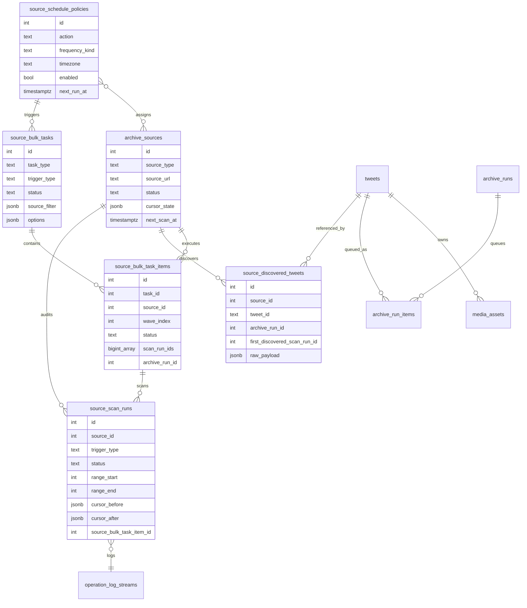
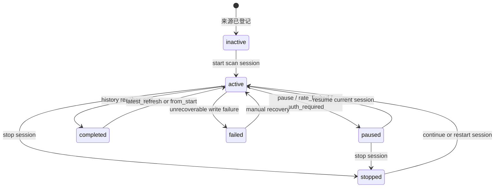
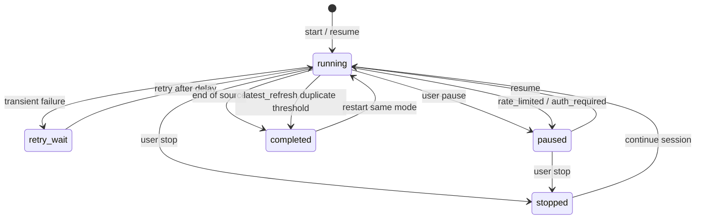
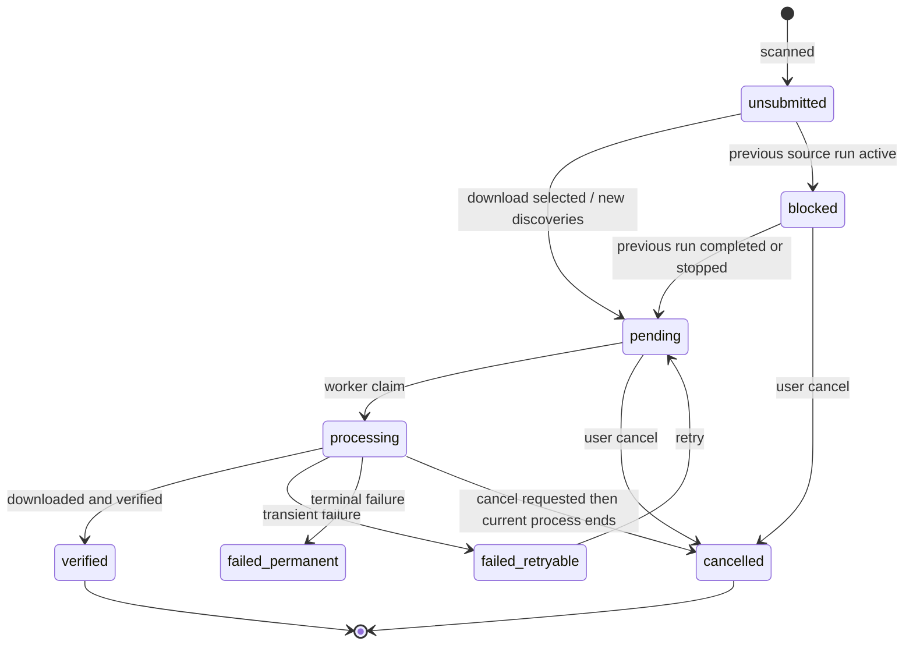
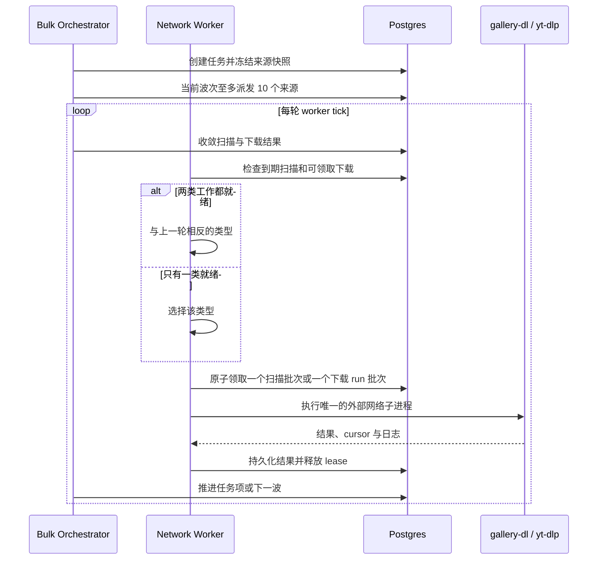

# 来源扫描业务设计与架构需求

本文定义 Sources 页面中“扫描来源”和“来源下载工作台”的业务边界、数据模型、状态机、后台调度与交付验收要求。它是来源扫描与下载整合后的实现依据，也用于后续审查 API、WebUI、worker 与数据库迁移是否保持一致。

## 1. 背景与目标

来源示例：

```text
https://x.com/earthcurated/media
```

一个来源代表需要持续发现 Tweet 的目标。系统把发现和下载拆成两个独立阶段：


核心目标：

- 扫描阶段只发现 Tweet 与媒体预估，下载由来源下载工作台显式触发。
- 同一来源同一时间只允许一个扫描会话。
- 历史扫描、补充最新推文、从头扫描/补断层分别持有独立 cursor。
- 扫描、暂停、停止、恢复必须可恢复、可审计。
- 同一来源同一时间只允许一个可运行下载 run；后续来源下载 run 必须进入 blocked。
- WebUI 必须把普通用户操作收敛到“扫描控制、下载工作台、发现列表”三个区域。
- 来源列表批量操作必须创建持久化父任务，而不是由浏览器循环调用单来源接口。
- “更新并下载本轮新增”必须使用扫描运行关联精确确定成员，不能按时间窗口推测。

非目标：

- 不在扫描子进程内下载真实媒体文件；下载由 archive queue worker 执行。
- WebUI 媒体库与重复媒体页允许按 `media_assets.id` 显式批量删除媒体文件。重复媒体按完整 SHA-256 组分页，可快捷保留建议项并选择其余副本；用户仍可手动调整选择。删除必须经过不可恢复确认、写操作串行化、`archive/media` 路径边界校验和审计；来源发现、Tweet 与下载历史保留，受影响 Tweet 标记为 `missing` 以支持手动重新归档。
- 不把全库扫描、全量校验等维护动作隐式塞入普通扫描请求。
- 不为旧的纯数字 checkpoint 兼容流程新增复杂迁移逻辑。

## 2. 业务边界

扫描业务负责：

- 调用 `gallery-dl` 枚举来源时间线或媒体页。
- 解析 Tweet ID、作者、正文、发布时间和媒体元数据。
- 将发现结果幂等写入 `source_discovered_tweets` 与 `tweets`。
- 更新当前 scan session cursor 和批次审计。
- 记录扫描日志、错误分类、等待下载队列等调度事件。

来源下载业务负责：

- 用户在来源工作台下载选中、新发现或失败项后创建带 `source_id` 的 `archive_runs` / `archive_run_items`。
- 暂停中的来源下载 run 不会自动吞入新扫描结果；新增下载动作创建新的不可变 run。
- 已有 paused/running/queued 来源 run 时，新 run 进入 `blocked`，等待前序 run 完成、停止或失败终止后释放。
- 同一 Tweet 同一时间只能存在一个 active item，重复提交应返回 linked/skipped 统计。
- 下载媒体文件到 `archive/media/<author_id>/<tweet_id>/`。
- 写入 `media_assets`、下载尝试记录、校验状态、item 进度和控制状态。
- 处理批量任务明确提交的“当前缺失项”或“本轮新增”；普通扫描仍不会隐式创建下载 run。

扫描发现的媒体数量来自页面元数据，是下载前预估。最终媒体数量和状态以下载后的 `media_assets` 与文件校验结果为准。

## 3. 扫描会话模型

Sources 详情页统一使用“扫描来源”面板，不再区分“基础扫描”和“高级扫描”。扫描会话分为三类：

| 会话模式 | active_scan_mode | trigger_type | 业务目标 | 停止规则 | 恢复规则 |
| --- | --- | --- | --- | --- | --- |
| 继续历史扫描 | `history` | `history_worker` | 从保存的历史 cursor 继续向更旧推文扫描 | 用户停止、来源末尾、限流或认证失败 | 从 history session cursor 继续 |
| 补充最新推文 | `latest_refresh` | `latest_refresh` | 从最新时间线补充新发 Tweet | 单批 `duplicate_count > 5`，或来源末尾 | 从 latest_refresh session cursor 继续 |
| 从头扫描/补断层 | `from_start` | `from_start_repair` | 从最新位置重新向旧内容完整扫描，用于修复中间断层 | 用户停止、来源末尾、限流或认证失败 | 从 from_start session cursor 继续 |

补充最新推文的重复阈值按单批统计。如果某一批 `duplicate_count > 5`，系统认为已经补到已知边界并完成该会话。历史扫描和从头扫描遇到重复 Tweet 不停止。

扫描批次大小要求：

- 最小值：5
- 最大值：200
- 默认值：来源上次扫描设置或 `SOURCE_SCAN_BATCH_SIZE`

## 4. 数据模型

### 4.1 核心表



`source_bulk_tasks.source_filter` 保存用户创建任务时的筛选条件用于审计，真正执行的来源集合在创建时冻结到 `source_bulk_task_items`。`source_discovered_tweets.first_discovered_scan_run_id` 只在首次插入时写入，重复扫描只合并 payload，因此组合任务可以精确选择本轮首次发现项。

### 4.2 cursor_state 结构

`archive_sources.cursor_state` 保存调度状态和每个会话的独立 checkpoint：

```json
{
  "active_scan_mode": "history",
  "automation_enabled": true,
  "automation_state": "running",
  "automation_limit": 20,
  "scan_sessions": {
    "history": {
      "mode": "history",
      "state": "running",
      "limit": 20,
      "next_start_index": 41,
      "extractor_cursor": "gallery-dl-continuation",
      "completed": false
    },
    "latest_refresh": {
      "mode": "latest_refresh",
      "state": "completed",
      "limit": 20,
      "next_start_index": 21,
      "completed": true
    },
    "from_start": {
      "mode": "from_start",
      "state": "paused",
      "limit": 20,
      "next_start_index": 61,
      "extractor_cursor": "gallery-dl-continuation",
      "completed": false
    }
  }
}
```

兼容要求：

- 顶层 `next_start_index` 和 `extractor_cursor` 只代表历史扫描兼容字段。
- `latest_refresh` 和 `from_start` 的进度不得覆盖历史扫描 cursor。
- WebUI 展示下一批范围时应优先读取当前 active session。
- `source_scan_runs.cursor_before` 和 `cursor_after` 应保留当批执行前后的可审计快照。

## 5. 状态机

### 5.1 来源级状态



来源表的 `status` 只描述对用户可见的总体状态。具体扫描会话状态由 `cursor_state.automation_state` 与 `scan_sessions[active_scan_mode].state` 描述。

### 5.2 会话级状态



暂停和停止都不会强制终止已经启动的 `gallery-dl` 子进程。当前批次会自然结束并写入审计记录，worker 在下一轮调度前重新读取来源状态。如果来源已暂停或自动任务已停止，则不会继续发起下一批。

### 5.3 来源下载状态



下载 run 的成员不可变。暂停后新扫描到的 Tweet 只进入发现池；恢复下载只恢复暂停 run，不会自动包含新发现。再次点击“下载新发现”或“下载选中”会创建新的 run。若前序来源 run 仍处于 `queued`、`running` 或 `paused`，新 run 必须进入 `blocked`。

新创建的来源下载 run 按发现列表的可见顺序入队，即 `discovered_at desc, id desc`，worker 在 run 内按 item 入队顺序从上到下领取。已有 run 和失败重试继续保留原始 item 顺序，避免改变历史任务的审计语义。

## 6. 后台调度设计



调度规则：

1. API 进程只启动一个网络 worker，避免扫描 `gallery-dl` 与下载 `gallery-dl` / `yt-dlp` 并发争用 cookies、带宽和限流额度。
2. 只有扫描就绪时执行扫描，只有下载就绪时执行下载；两类同时就绪时严格交替，防止任一类别长期饥饿。
3. 下载 worker 每次只从一个 run 领取至多 `QUEUE_BATCH_SIZE` 条，run 按 `last_dispatched_at nulls first` 排序，因此多个来源会轮转获得进度。
4. 批量任务默认每 10 个来源形成一波。前一波仍有 queued、scanning、waiting_download 或 downloading 项时，不派发下一波。
5. `refresh_latest` 完成扫描后直接成功；`download_missing` 提交当前缺失项；`refresh_and_download_new` 只提交与该任务项扫描运行关联的首次发现 Tweet。
6. 普通详情页扫描与下载仍是两个显式动作。只有组合批量任务或已启用的同类定时策略会自动衔接本轮新增下载。
7. 未完成扫描仍根据 `SOURCE_SCAN_SLEEP_MIN_SECONDS` 和 `SOURCE_SCAN_SLEEP_MAX_SECONDS` 随机延后下一批；计划时间表示 not-before。

定时策略规则：

- 支持固定间隔、每日和每周锚点；数据库保存 UTC，WebUI 默认按 `Asia/Shanghai` 创建和展示。
- 策略默认关闭。停机错过多次或上一次任务尚未结束时只合并补跑一次，不追赶每个历史触发点。
- 计划任务只支持更新最新推文，或更新并下载本轮新增，不自动下载历史缺失积压。
- 定时下载默认每来源最多 50 条、每任务最多 1000 条；人工“下载当前缺失项”预计超过 500 条时要求确认。
- 失败来源重试保留原任务的安全属性：定时任务仍受 50/1000 上限约束；人工缺失下载在重试时重新估算，超过 500 条仍需显式确认。
- 同一父任务出现 3 个 `auth_required` 或 `rate_limited` 来源项后进入 blocked，等待用户处理 cookies/限流并手工恢复。

运行中的批次会把 `gallery-dl --verbose` 日志写入 `archive/logs/source-scan-logs/` 下的 JSONL 文件。数据库保存日志流索引和摘要。Sources 详情页通过“查看最新扫描日志”打开弹层，`Operations -> Logs` 可查看同一日志流。

## 7. WebUI 交互需求

### 7.1 来源列表与批量任务

- 列表支持逐项勾选和“当前筛选全部”。后者在服务端冻结成员，最多 200 个；超过上限时要求先缩小筛选。
- 已删除来源不参与批量选择。`profile`、`user_media`、`likes` 可刷新；不支持扫描的来源在刷新任务中逐项跳过，不让父任务整体失败。
- 列表时间必须区分：`latest_tweet_published_at` 是最新 Tweet 发布时间，`last_success_at` 是最近成功同步；`updated_at` 不能用于表达数据新鲜度。
- 下载积压同时展示未提交、排队、处理中和失败数量；失败数按来源内每个 Tweet 的最新下载条目计算，后续成功不会保留历史失败告警；任务状态与下次执行时间在列表直接可见。
- 任务中心展示父任务进度和逐来源结果，支持暂停、恢复、取消，以及只用失败来源创建重试任务。
- 三个批量动作分别是“更新最新推文”“下载当前缺失项”“更新并下载本轮新增”。前两者互不隐式依赖，组合动作由服务端保证顺序。

### 7.2 页面状态与按钮

| 页面状态 | 主按钮 | 说明 |
| --- | --- | --- |
| 无数据、无会话 | 开始扫描 | 启动 history session |
| 运行中 | 暂停、停止、查看最新扫描日志 | 不展示其他扫描入口 |
| 已暂停 | 恢复当前会话、停止 | 恢复按钮显示当前会话语义 |
| 已停止 | 继续上次会话，并展示合理分叉 | 例如继续补最新、继续历史扫描 |
| 历史扫描完成 | 补充最新推文、从头扫描/补断层 | 从头扫描属于修复入口 |
| 补最新完成 | 再次补充最新推文 | 表示已补到已知记录 |

### 7.3 展示指标

| 指标 | 含义 |
| --- | --- |
| 已发现 Tweet | 当前来源已记录的去重 Tweet 数量 |
| 扫描发现媒体 | 扫描元数据聚合得到的媒体项数量，下载前为预估 |
| 待下载发现 | 已发现但尚未完成本地归档的 Tweet 数量 |
| 下一批范围 | 当前 active session 将使用的 Tweet 窗口 |
| 扫描状态 | 当前 active session 是否可继续、已完成或进入重复区 |
| 历史扫描任务 | 当前会话模式和后台调度状态 |
| 下次自动扫描 | 下一轮后台扫描计划执行时间 |
| 累计扫描批次 | 实际发起过枚举的批次数，`waiting_downloads` 不计入 |
| 累计新增 Tweet | 扫描批次首次发现并写入当前来源的 Tweet 数 |
| 最近成功扫描 / 最近扫描错误 | 用于判断后台停止增长的原因 |

### 7.4 下载工作台交互

| 场景 | 系统行为 | 用户可见结果 |
| --- | --- | --- |
| 暂停下载后继续扫描 | 新 Tweet 只进入发现池 | 旧 run 仍显示暂停，新发现显示待下载 |
| 继续下载 | 只恢复暂停 run | 不自动包含暂停后新发现 |
| 下载缺失项 | 创建新的来源 run | 只提交当前筛选中未完成的 Tweet，已完成项不会重新下载 |
| 下载选中 | 只提交选中且未 active/未完成 Tweet | 已有任务和已归档项被跳过 |
| 按媒体类型下载 | 发现列表按 `media_type=video/photo` 筛选 Tweet 后提交缺失项 | 命中的 Tweet 整体处理；图文混合 Tweet 会同时命中视频和图片筛选 |
| 重新下载当前筛选 | 使用高级下载入口强制提交当前筛选 | 会包含已完成项，需二次确认，通常只用于修复本地文件 |
| 取消选中 | pending/blocked 变 `cancelled`，processing 标记取消请求 | 当前子进程自然结束 |
| 停止下载 | 取消未开始 item，processing 自然结束 | 后续 blocked run 可被释放 |

### 7.5 交互约束

- 运行中只允许暂停、停止、查看日志，不展示新的扫描入口。
- 暂停后允许恢复当前会话或停止当前会话。
- 停止后保留 cursor，允许继续当前会话，也允许按业务规则启动分叉会话。
- 下载工作台必须独立于扫描控制，避免把“暂停扫描”和“暂停下载”混为一个动作。
- 发现列表只允许页内选择；跨页批量下载必须使用“下载缺失项”入口。
- 用户触发默认下载时必须明确知道已完成项不会重新下载；强制重下只能从高级入口触发。
- 删除来源是软删除：只隐藏来源配置并停用后续自动扫描，不删除已归档 Tweet、媒体文件、下载任务、发现记录或扫描历史。
- 删除来源前必须确认该来源没有运行中扫描批次，也没有 queued/running/paused/blocked 下载 run；系统不得隐式停止这些工作。
- 软删除后再次新增相同规范化 URL 会恢复原来源记录并保留历史，不创建第二条来源历史。
- 来源列表默认只显示未删除来源；可通过 `GET /api/v1/sources?deleted=deleted` 查看已删除来源，通过 `deleted=all` 同时查看未删除与已删除来源。
- 单个已删除来源的详情、发现记录、扫描历史和下载摘要仅用于只读审计，读取时需传 `include_deleted=true`；写操作仍默认拒绝已删除来源。

## 8. API 需求

| Endpoint | 用途 | 返回 |
| --- | --- | --- |
| `POST /api/v1/sources/{source_id}/scan-sessions` | 启动或继续指定扫描会话 | `ArchiveSourceDetailResponse` |
| `POST /api/v1/sources/{source_id}/scan-sessions/pause` | 暂停当前扫描会话 | `ArchiveSourceDetailResponse` |
| `POST /api/v1/sources/{source_id}/scan-sessions/resume` | 恢复当前扫描会话 | `ArchiveSourceDetailResponse` |
| `POST /api/v1/sources/{source_id}/scan-sessions/stop` | 停止当前扫描会话 | `ArchiveSourceDetailResponse` |
| `GET /api/v1/sources/{source_id}` | 获取来源详情、汇总、active run | `ArchiveSourceDetailResponse` |
| `GET /api/v1/sources/{source_id}/discovered` | 分页查看发现 Tweet；支持 `media_type=video/photo`、`queue_state=unsubmitted/submitted`、`download_state=pending/active/completed/failed` 服务端筛选，并在首页返回分面计数 | `SourceDiscoveryPageResponse` |
| `GET /api/v1/sources/{source_id}/scan-runs` | 分页查看扫描批次审计 | `SourceScanRunsPageResponse` |
| `GET /api/v1/log-streams/{stream_id}` | 查看扫描日志 | `OperationLogEntriesResponse` |
| `GET /api/v1/sources/{source_id}/downloads` | 查看来源下载工作台汇总、active/paused/blocked runs，并通过 `current_tweet_id` 标识下载器当前处理项 | `SourceDownloadSummaryResponse` |
| `POST /api/v1/sources/{source_id}/downloads` | 下载选中、缺失项、失败项，或高级重下当前筛选 | `ArchiveSubmissionResponse` |
| `POST /api/v1/sources/{source_id}/submit-discovered` | 兼容旧入口，等价于提交尚未关联下载任务的发现项 | `ArchiveSubmissionResponse` |
| `DELETE /api/v1/sources/{source_id}` | 软删除来源配置，需 `confirm_delete=true` | `SourceDeleteResponse` |
| `POST /api/v1/archive-runs/{run_id}/pause` | 暂停下载 run，不强杀当前子进程 | `ArchiveRunControlResponse` |
| `POST /api/v1/archive-runs/{run_id}/resume` | 恢复暂停下载 run | `ArchiveRunControlResponse` |
| `POST /api/v1/archive-runs/{run_id}/stop` | 停止下载 run，取消未开始 item | `ArchiveRunControlResponse` |
| `POST /api/v1/archive-runs/{run_id}/items/cancel` | 取消 pending/blocked item，processing item 仅标记取消请求 | `ArchiveRunControlResponse` |
| `POST /api/v1/source-bulk-tasks` | 按显式来源 ID 或当前筛选快照创建批量任务 | `SourceBulkTaskResponse` |
| `GET /api/v1/source-bulk-tasks` | 分页查看父任务和聚合进度 | `SourceBulkTasksPageResponse` |
| `GET /api/v1/source-bulk-tasks/{task_id}` | 查看父任务与逐来源任务项 | `SourceBulkTaskResponse` |
| `POST /api/v1/source-bulk-tasks/{task_id}/control` | 暂停、恢复或取消父任务 | `SourceBulkTaskResponse` |
| `POST /api/v1/source-bulk-tasks/{task_id}/retry` | 仅冻结原任务失败来源创建重试任务；大型人工下载通过 `confirm_large_download` 再确认 | `SourceBulkTaskResponse` |
| `GET/POST /api/v1/source-schedule-policies` | 列出或创建命名定时策略 | `SourceSchedulePolicyResponse` |
| `PATCH /api/v1/source-schedule-policies/{policy_id}` | 修改策略并重算下次执行 | `SourceSchedulePolicyResponse` |
| `PUT /api/v1/source-schedule-policies/{policy_id}/sources` | 替换策略成员 | `SourceSchedulePolicyResponse` |
| `DELETE /api/v1/source-schedule-policies/{policy_id}` | 删除策略并保留历史任务 | `204` |

接口约束：

- 状态切换接口必须返回完整 `ArchiveSourceDetailResponse`，不能返回基础 source row。
- 新增或调整 API schema 后必须同步 `webui/src/api/generated.ts`。
- 写操作必须保持 API 进程内锁语义或显式更新并发策略。
- 所有错误响应不得暴露 cookie、生产连接串或其他凭据。
- 下载提交必须按 Tweet 加锁并保持幂等，不能为同一 Tweet 创建多个 active item。
- `POST /api/v1/sources/{source_id}/downloads` 可携带 `media_type=video/photo`；该参数是 Tweet 级筛选，只决定哪些发现 Tweet 被提交处理，不改变单个 Tweet 内媒体项的下载范围。
- 默认 scope `download_missing` 只提交当前筛选中未完成且当前没有活动下载任务的 Tweet；`redownload_filter` 才会重新提交已完成项，保留给高级操作。
- 同一来源只能有一个 runnable 下载 run；后续来源 run 使用 `blocked` 等待释放。
- WebUI 仅在用户本次触发下载或恢复时自动跟随目标 run；自动跟随使用列表顺序中的单向队列游标，只在游标越过视口下边界时向下滚动。并发下载回头处理游标上方的 Tweet 时仍更新真实当前项高亮，但不得自动向上拉回列表。
- 鼠标滚轮、触摸拖动、键盘翻页或展开 Tweet 正文会暂停自动跟随；“继续跟随”回到已记录的队列游标，“定位当前项”是允许跳到 `current_tweet_id` 并从该位置重建游标的显式操作。已有运行任务只提供显式定位入口。

## 9. 错误处理与恢复

| 场景 | 系统行为 | 用户可见结果 |
| --- | --- | --- |
| 扫描与下载同时就绪 | 单网络 worker 与上一轮相反类型交替执行 | 两类任务都持续获得进度且不并发外部子进程 |
| `gallery-dl` 限流 | 当前会话暂停，记录 `rate_limited` | 用户可恢复或停止 |
| 认证失败 | 当前会话暂停，记录 `auth_required` | 用户更新 cookie 后恢复 |
| 网络或临时失败 | 记录错误，按 retry wait 调度 | 用户可查看批次错误和日志 |
| API 中途停止 | 启动恢复逻辑标记遗留 running scan 为 interrupted | 后续可从已保存 cursor 继续 |
| 用户暂停 | 当前批次自然结束，下一轮不再调度 | 页面显示已收到暂停状态 |
| 用户停止 | 关闭 automation，保留 session cursor | 页面展示继续或分叉入口 |
| 下载 run 暂停 | 不再 claim 后续 item，processing 自然结束 | 下载工作台显示暂停，可继续或停止 |
| 下载 run 停止 | pending/blocked/failed_retryable 变 cancelled，processing 标记取消请求 | 下载工作台显示已停止，后续 blocked run 释放 |
| 重复点击下载 | 事务锁和唯一 active item 约束阻止重复 item | 返回已有任务和已归档统计 |
| 同一来源已有 active run | 新来源 run 进入 blocked | 页面显示等待前序任务 |
| 批量任务包含不支持扫描或已暂停来源 | 对应来源项标记 skipped | 父任务继续处理其他来源并显示原因 |
| 批量任务部分来源失败 | 父任务完成为 `completed_with_issues` | 用户可仅重试失败来源 |
| 连续 3 个认证/限流来源失败 | 父任务进入 `blocked` | 更新 cookies 或等待限流解除后手工继续 |
| 定时策略执行重叠或停机错过多次 | 合并为至多一个新任务并推进锚点 | 不积压一串补跑任务 |

扫描网络请求默认使用 `SOURCE_SCAN_HTTP_TIMEOUT_SECONDS=15` 和
`SOURCE_SCAN_HTTP_RETRIES=2`。gallery-dl 可能在 HTTP 重试耗尽后仍返回退出码 0；
worker 会额外识别末次重试错误，将整批标记为 `network_error`，不保存不完整输出，
也不推进 continuation cursor。

## 10. 验收要求

后端验收：

- `history`、`latest_refresh`、`from_start` 各自独立保存 cursor。
- `latest_refresh` 只有在单批 `duplicate_count > 5` 或来源末尾时完成。
- `from_start` 遇到重复 Tweet 不提前完成。
- 兼容路径产生的 `waiting_downloads` 与扫描失败审计必须使用 active session 的范围。
- 暂停、恢复、停止接口必须通过 FastAPI response model 校验。
- 新增 `trigger_type` 必须有 Alembic revision 更新数据库约束。
- 批量任务的来源成员必须在创建时冻结，页面关闭或后续筛选变化不能改变成员。
- `refresh_and_download_new` 只能提交 `first_discovered_scan_run_id` 属于该任务项的发现记录。
- 波次未收敛前不得派发下一波；多个下载 run 必须轮转领取。
- 定时策略默认关闭，重叠/错过合并，且下载上限与认证熔断可审计。

前端验收：

- Sources 详情页只有一个“扫描来源”入口。
- Sources 详情页必须包含独立下载工作台，显示 active/paused/blocked run、速度、大小和进度摘要。
- 发现列表支持页内勾选、下载选中、下载新发现、重试失败、行级下载和取消。
- 暂停下载后继续扫描，新发现不能自动加入旧 run。
- 有 paused/running/queued 来源 run 时再次下载新发现，新 run 必须显示 blocked。
- 运行中不展示其他扫描入口。
- 暂停后恢复按钮显示当前会话语义。
- 补最新完成时显示“补充最新推文已完成”，不能误显示“历史扫描已完成”。
- 下一批范围优先读取 active session。
- 日志弹层和 `Operations -> Logs` 能打开同一日志流。
- Sources 列表在桌面展示最新内容、最近同步、下载积压、任务和下次执行；窄屏保留核心摘要。
- 批量任务中心支持暂停、恢复、取消和仅重试失败项；关闭页面后任务仍继续。
- 当前筛选全部超过 200 个时不能静默只操作已加载 50 个来源。

建议验证命令：

```bash
docker-compose run --rm --entrypoint python xarchiver -m unittest discover -s /app/tests
cd webui && npm run build
```

轻量改动可至少运行：

```bash
git diff --check
docker-compose run --rm --entrypoint python xarchiver -m unittest tests.test_queue_integration tests.test_sources tests.test_api_v1_routes
cd webui && npm run typecheck
```
