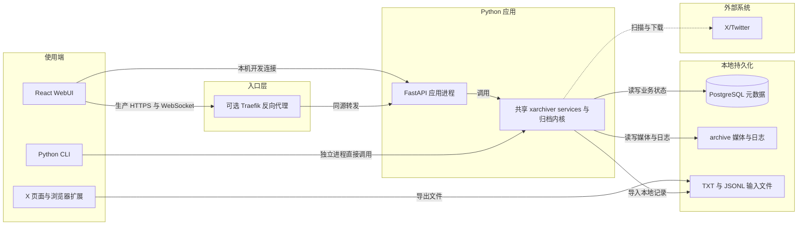
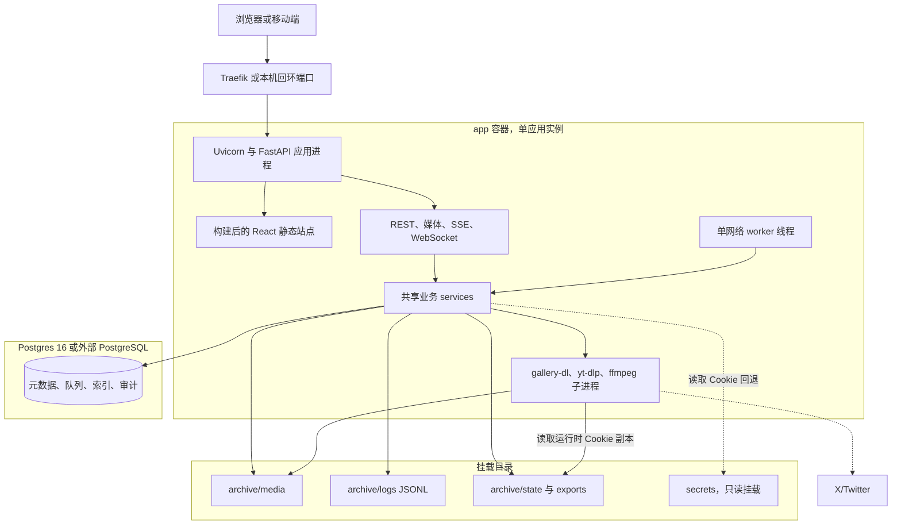
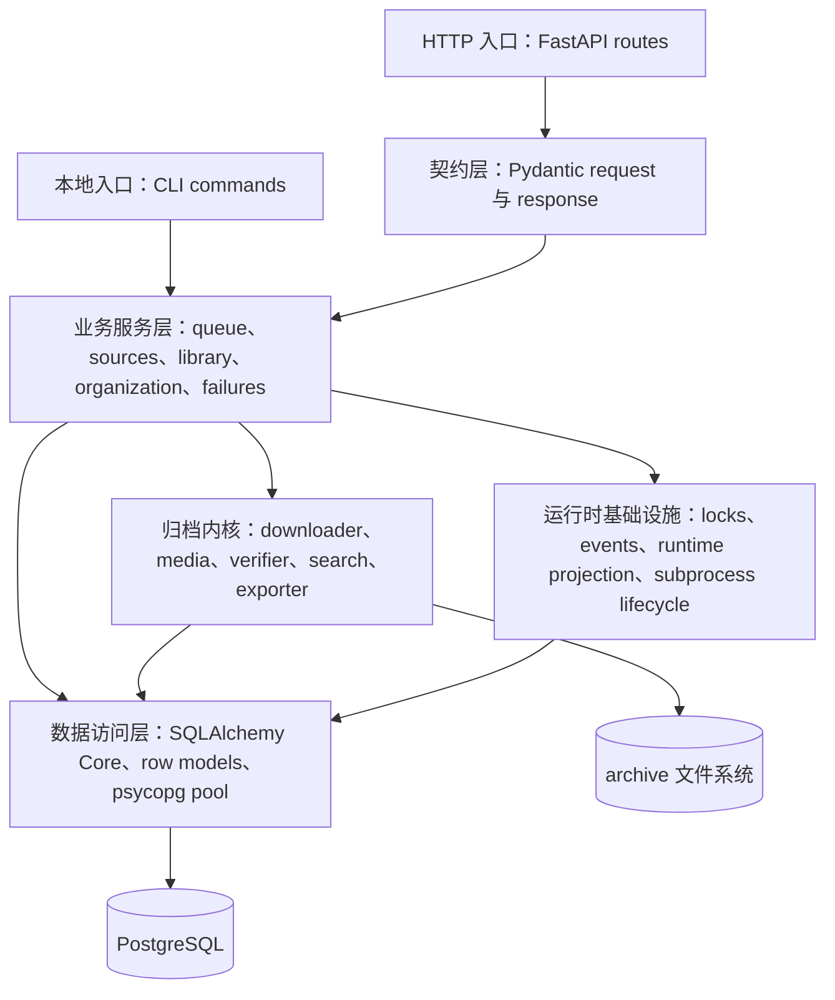
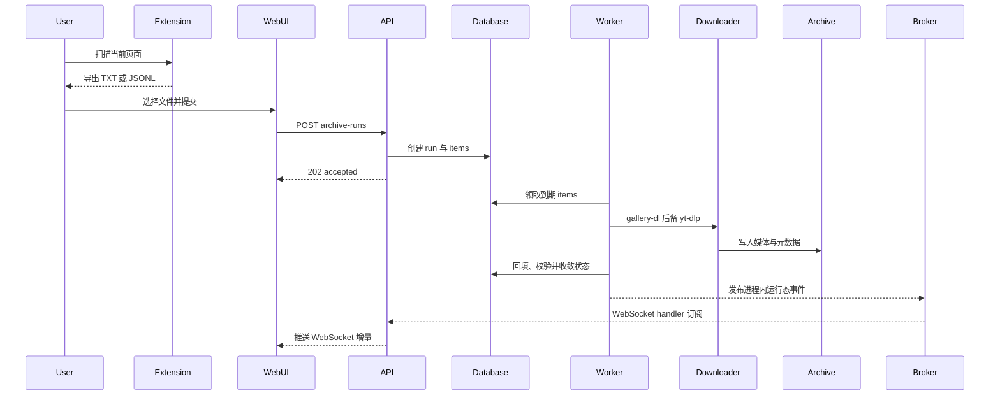
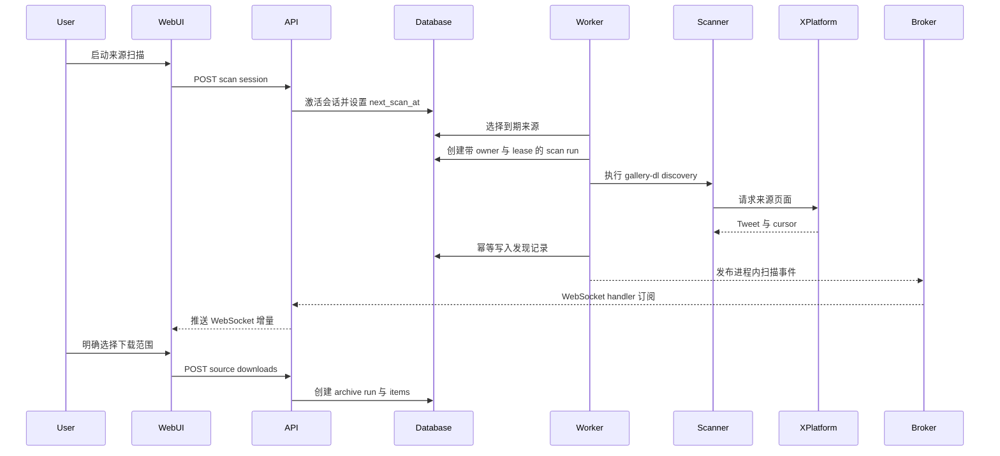
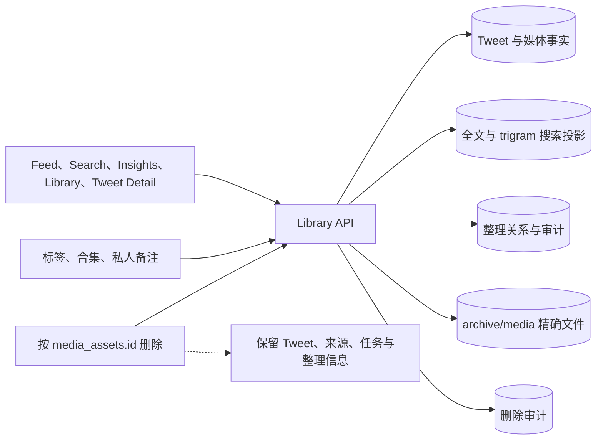

# 系统架构总览

本文描述 `x-media-archiver` 当前已经落地的系统边界、部署拓扑、模块职责和跨模块数据流。详细下载规则、来源扫描状态机和实时通道协议分别由专题文档维护，本文只保留稳定的全局视图。

## 1. 设计目标与边界

系统的核心目标是把 X/Twitter 上明确选定的 Tweet 媒体保存到本地，同时保留可检索、可整理、可恢复和可审计的元数据。

当前架构有五条硬边界：

1. **本地优先**：媒体文件和操作日志写入本地 `archive/`；Postgres 保存业务状态、索引和审计。
2. **单管理员、单应用实例**：Web/API 使用一个管理员账号；单个应用进程内运行一个网络 worker，不承诺多实例主动处理。
3. **发现与下载分离**：来源扫描只发现 Tweet；只有人工动作或明确启用的策略才创建下载 run。
4. **数据库任务模型**：运行时队列由 `archive_runs` / `archive_run_items` 等 Postgres 表驱动；TXT/JSONL 只是输入适配器。
5. **持久事实与运行态投影分离**：数据库决定最终状态；WebSocket、SSE、Runtime Store 和 React Query 缓存只负责展示与收敛。

明确不在当前架构内的能力：多租户、分布式 worker、外部消息队列、跨实例 runtime bus、扩展直投 API、模型推理服务和公网 SaaS 化。

## 2. 系统上下文

浏览器扩展不直接访问本地 API。它只读取当前页面已经渲染的 Tweet，导出 TXT/JSONL 文件，再由用户通过 CLI 或 WebUI 提交。服务端来源扫描是另一条受控入口，它使用 gallery-dl 和本地 Cookie 主动读取 X/Twitter。



说明：图中的共享内核表示同一套 Python 代码，不表示一个独立常驻服务。CLI 是与 FastAPI 分开的进程，直接加载这些 service 和归档模块并访问数据库、文件系统，不经过 Web 登录或 HTTP；WebUI 在本机开发时直连 FastAPI，在生产环境中经可选的 Traefik 同源转发。

## 3. 运行时部署拓扑

生产镜像是一个自包含应用镜像：构建阶段生成 WebUI 静态文件，运行阶段由 FastAPI 同源提供页面、REST、媒体文件和只读 Runtime WebSocket。应用进程启动时先执行 Alembic migration，再启动 Uvicorn；应用 lifespan 打开连接池、检测过期 archive item lease、收敛遗留扫描，并启动一个负责后台队列的网络 worker 线程。



部署约束：

- Compose 必须启用 `init: true`，以回收被终止进程组留下的子孙进程。
- 生产 WebUI 与 API 必须同源；公网入口使用 HTTPS，代理必须正确透传 Host 和可信协议头。
- `secrets/` 只读挂载；数据库中的 Cookie 内容也不得出现在查询响应或操作日志中。
- 完整恢复业务状态与媒体至少需要 Postgres 和 `archive/media/`；日志、原始输入、运行状态与可重建导出按分级策略处理，见部署手册。

## 4. 应用内模块分层

FastAPI 和 CLI 只是入口适配层。可复用的业务规则集中在 `cli/xarchiver/services/` 与归档内核中，数据库访问通过 SQLAlchemy Core 构造查询、psycopg 执行，并在 service 边界使用 Pydantic row model 收敛类型。



| 层级 | 主要路径 | 责任 | 不应承担 |
| --- | --- | --- | --- |
| 入口适配 | `cli.py`、`api/v1/` | 解析输入、认证、HTTP 状态和调用 service | 复制归档规则或直接拼复杂 SQL |
| 契约 | `api/schemas/`、OpenAPI types | 校验请求、约束响应、前后端类型同步 | 充当内部数据库 row model |
| 业务服务 | `services/` | 事务、状态迁移、任务编排、审计 | 页面展示逻辑或浏览器缓存 |
| 归档内核 | `downloader.py`、`media.py`、`verifier.py`、`search.py` | 外部工具调用、媒体处理、检索 | 决定 HTTP 行为 |
| 运行时基础设施 | `core/`、runtime services | 进程内锁、事件投影、进程回收、诊断 | 成为持久业务事实源 |
| 数据访问 | `tables.py`、`row_models.py`、`sql_builder.py`、`db.py` | 查询构造、连接池和边界类型 | 引入 SQLAlchemy ORM 会话状态 |

固定 SQL 只用于 Alembic、advisory lock、Postgres 特性或已有复杂查询的渐进迁移。新增常规查询和 DML 默认使用 SQLAlchemy Core。

## 5. 三条核心数据流

### 5.1 文件采集与归档



WebUI 在浏览器侧解析输入文件后提交结构化记录；后端按 run 内 Tweet 去重，并避免同一 Tweet 同时存在多个 active item。下载成功后只回填和校验本轮影响的媒体；全库扫描是独立维护动作。

### 5.2 来源发现与明确下载



扫描结果写入 `source_discovered_tweets`，不会自动进入归档队列。“更新并下载本轮新增”属于显式批量任务，它通过扫描 run 关联精确选择本轮首次发现的 Tweet。

### 5.3 查询、整理与删除



搜索投影由数据库 trigger 在 Tweet、标签、合集或备注变化后刷新。物理删除只接受稳定的 `media_assets.id`，路径必须落在 `archive/media` 内；删除媒体后 Tweet 和整理关系继续保留，Tweet 状态收敛为 `missing`。

## 6. 持久事实与实时投影

系统同时存在 REST、WebSocket、SSE、React Query 和 Zustand Runtime Store，但它们不具有同等权威性：

```text
PostgreSQL              最终业务事实与恢复依据
archive 文件系统        媒体和 JSONL 操作日志事实
REST                    数据库事实的分页快照与写入口
Runtime WebSocket       活跃与最近状态的有界投影
SSE                     兼容事件流，不驱动根级 Runtime Store
React Query             页面资源缓存
Zustand Runtime Store   行级进度与连接状态 overlay
```

进度事件只修改 runtime overlay；完成、失败、取消、删除等边界事件还会触发相关 REST query 失效。WebSocket 断开、epoch 变化或序列不连续时，前端通过 `/api/v1/runtime/snapshot` 重建运行态；实时通道不可用时退化为快照轮询。

详细协议与收敛规则见 [WebUI 实时运行态](runtime-realtime-evolution.md)。

## 7. 安全与信任边界

- `AuthMiddleware` 保护 Web/API 路由；Runtime WebSocket 额外校验 session、Origin 与 Host。
- 管理员会话仅把 token 哈希写入数据库；密码使用推荐哈希算法保存。
- X/Twitter Cookie 可来自只读本地文件或数据库配置；主动检测使用的临时文件权限为 `0600` 并在完成后删除，下载器运行副本位于 `archive/state`，日志统一脱敏。
- `media_assets` 中的历史路径可能是绝对路径或相对路径；对外读取会先转换为 `archive/` 相对路径并校验边界。操作日志只保存服务端生成的相对路径，读取时再次阻止目录逃逸。
- 全量 backfill、全量 verify 和物理删除保留显式确认；API 作用域锁用于单进程内的尽力型冲突抑制，数据正确性仍依靠事务、数据库约束、行锁和 advisory lock。
- 对 X/Twitter 的主动请求只发生在来源扫描、Cookie 检测和下载流程中；使用外部 PostgreSQL 时应用还会建立数据库网络连接。测试不得使用真实账号做批量请求。

## 8. 架构演进条件

当前设计刻意针对单实例本地部署。出现以下任一条件时，需要新的 ADR，而不能直接横向扩容：

- 需要两个以上应用实例同时消费队列。
- 需要跨机器共享实时事件或写命令通道。
- 需要多用户数据隔离、权限模型或审计主体。
- 媒体存储从本地目录迁移到对象存储。
- 扩展需要直接提交 API，而不再经过文件交接。

多实例演进至少需要重新设计：分布式调度所有权、跨实例写锁、runtime pub/sub、Cookie 密钥管理、日志存储和媒体文件一致性。

## 9. 相关文档

- [核心数据模型](data-model.md)
- [可靠性与一致性设计](reliability-and-consistency.md)
- [下载器契约](downloader-contract.md)
- [来源扫描工作流](source-scanning-workflow.md)
- [WebUI 实时运行态](runtime-realtime-evolution.md)
- [部署与备份恢复](../deploy/README.md)
