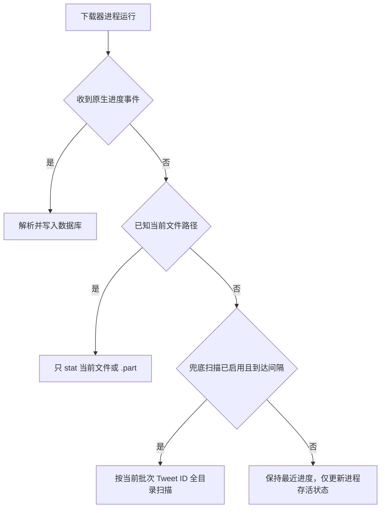

# 下载进度采集改造设计

> 状态：已实现，待真实下载验收  
> 范围：下载器进度采集与配置，不修改队列认领、重试、下载顺序和归档路径规则。

## 1. 背景

当前 `run_command_with_progress()` 在下载器未输出可解析进度时，每秒调用
`estimate_downloaded_bytes_by_tweet()`，后者通过 `archive/media/**/*`
递归遍历整个媒体目录，再按路径中的 Tweet ID 汇总文件大小。

该实现的问题是：

- 扫描成本随整个归档规模增长，而不是随当前下载批次增长。
- 每秒执行全目录遍历和文件 `stat`，在大量目录下会持续占用磁盘 I/O 与 CPU。
- Windows Defender、文件索引服务等可能放大扫描成本。
- gallery-dl 实际具备结构化进度输出能力，当前没有优先使用。

本设计中的“采用 1、2、3”指：

1. yt-dlp 使用原生进度模板。
2. gallery-dl 使用可解析的原生输出。
3. 必须读取磁盘时，只读取当前明确文件路径。

全目录递归扫描仅作为最后兜底，默认间隔改为 10 秒，并支持配置或关闭。

## 2. 目标

- 正常下载流程不再每秒递归扫描整个 `archive/media`。
- yt-dlp 和 gallery-dl 优先使用下载器原生进度。
- 已知当前文件路径时，只对当前 `.part` 或目标文件执行 `stat`。
- 原生输出和定向读取均不可用时，才执行全目录兜底扫描。
- 兜底扫描默认每 10 秒执行一次，可通过环境变量配置，设置为 `0` 时禁用。
- 继续写入现有的 `downloaded_bytes`、`total_bytes`、`speed_bps`、
  `progress_message` 和 `last_progress_at`，不新增数据库迁移。
- WebUI 继续使用现有字段，不新增新的前端状态模型。

## 3. 非目标

- 不修改 `QUEUE_BATCH_SIZE`。
- 不改变 `gallery-dl -> yt-dlp -> backfill -> verify` 的执行顺序。
- 不修改失败分类、重试次数或退避时间。
- 不引入文件系统 watcher 依赖。
- 不把正在处理的 item 提前标记为完成。

## 4. 进度来源优先级



优先级固定为：

```text
下载器原生进度
  > 当前文件定向 stat
  > 低频全目录兜底扫描
```

原生进度一旦可用，本次下载器进程后续不再执行全目录扫描。

## 5. yt-dlp 设计

保留当前 `--newline` 和 `--progress-template` 方案：

```text
xarchiver-progress:
  tweet_id
  status
  downloaded_bytes
  total_bytes
  total_bytes_estimate
  speed
```

调整要求：

- 继续通过稳定前缀识别事件，不解析 yt-dlp 默认人类可读日志。
- `total_bytes` 缺失时使用 `total_bytes_estimate`。
- 收到第一条有效进度后，将该进程标记为 `native_progress_seen`。
- `native_progress_seen=true` 后不运行磁盘兜底采样。
- 可选增加 `--progress-delta 1`，限制原生事件输出频率，避免过密写库。

## 6. gallery-dl 设计

gallery-dl 官方配置支持自定义 `output.mode`，其中：

- `start`、`success`、`skip` 可以输出当前文件名。
- `progress` 可以输出已下载字节和速度。
- `progress-total` 可以额外输出总字节和百分比。
- `downloader.*.progress` 控制原生进度输出间隔。

下载命令通过临时运行时配置或 `-o` 参数覆盖输出格式，使用稳定前缀：

```text
xarchiver-gdl:start|<filename>
xarchiver-gdl:progress|<downloaded>|<speed>|<total>|<percent>
xarchiver-gdl:success|<filename>
xarchiver-gdl:skip|<filename>
```

实现约束：

- 每条事件必须以换行结束，不能依赖终端的 `\r` 覆盖行为。
- 输出使用 pipe 模式并关闭 ANSI 颜色，避免控制字符影响解析。
- `start` 事件建立当前文件上下文。
- 从文件路径的 `<author_id>/<tweet_id>/` 结构解析 Tweet ID。
- 后续 `progress` 事件归属到最近一次有效 `start` 对应的 Tweet。
- `progress` 中的 `K/M/G` 或 `Ki/Mi/Gi` 格式化值需还原为整数字节。
- `success` 清零该 Tweet 的速度，并保留最终字节数。
- 无法解析路径或 Tweet ID 时记录调试日志，但不能使下载失败。

参考：

- [gallery-dl Configuration](https://gdl-org.github.io/docs/configuration.html)
- [gallery-dl Command-Line Options](https://gdl-org.github.io/docs/options.html)

## 7. 定向磁盘读取

收到 gallery-dl `start` 事件后，保存当前明确文件路径：

```text
archive/media/<author_id>/<tweet_id>/<filename>
```

定向采样只检查：

```text
<target_path>.part
<target_path>
```

规则：

- `.part` 存在时读取 `.part`。
- `.part` 不存在且目标文件存在时读取目标文件。
- 两者都不存在时返回未知，不向数据库写入虚假 0。
- 速度通过相邻两次定向采样的字节差计算。
- 定向采样可以保持 1 秒间隔，因为每次最多执行少量明确路径的 `stat`。

该路径只作为 gallery-dl 原生字节进度缺失时的补充，不覆盖下载器已提供的
`total_bytes` 和 `speed_bps`。

## 8. 全目录兜底扫描

保留现有 `estimate_downloaded_bytes_by_tweet()`，但限制为最后兜底：

- 当前进程没有原生进度事件。
- 没有可解析的当前文件路径。
- 兜底功能未被配置关闭。
- 距离上次兜底扫描已经达到配置间隔。

新增环境变量：

```text
DOWNLOADER_PROGRESS_FALLBACK_INTERVAL_SECONDS=10
```

配置语义：

| 值 | 行为 |
| --- | --- |
| `0` | 禁用全目录兜底扫描 |
| `1-300` | 按指定秒数执行兜底扫描 |
| 未设置 | 默认 `10` 秒 |

建议 Pydantic 配置：

```python
downloader_progress_fallback_interval_seconds: float = Field(
    default=10.0,
    alias="DOWNLOADER_PROGRESS_FALLBACK_INTERVAL_SECONDS",
    ge=0.0,
    le=300.0,
)
```

需要同步：

- `cli/xarchiver/config.py`
- `.env.example`
- `docker-compose.yml`
- `README.md`
- `docs/deploy/README.md`
- 下载策略 API 响应与 `webui/src/api/generated.ts`，如果该配置需要在
  Operations 页面展示

第一阶段不要求 WebUI 可编辑该值，只要求通过部署环境变量配置。

## 9. 后端实现拆分

建议将 `run_command_with_progress()` 中的职责拆分为：

```text
parse_yt_dlp_progress(line)
parse_gallery_dl_progress(line)
resolve_gallery_dl_progress_path(filename, archive_dir)
sample_current_download_path(path, previous_sample)
should_run_fallback_scan(last_scan_at, interval)
persist_progress_sample(...)
```

进程级状态建议使用一个轻量结构：

```python
DownloadProgressState(
    native_progress_seen=False,
    current_tweet_id=None,
    current_path=None,
    previous_bytes=0,
    previous_sample_at=None,
    last_fallback_scan_at=None,
)
```

stdout/stderr 读取线程只负责解析事件并更新状态；主循环负责定时采样和进程退出判断。
数据库写入继续复用 `mark_run_items_tweet_progress()`。

## 10. WebUI 行为

WebUI 不需要修改进度计算协议：

- 有 `total_bytes`：显示百分比。
- 只有 `downloaded_bytes`：显示已下载大小和“估算中”。
- 有 `speed_bps`：显示实时速度。
- 没有任何字节信息但 item 正在处理：显示“下载器处理中”。

“估算中”表示总字节未知，不表示正在执行全目录扫描。

## 11. 测试计划

### 单元测试

- yt-dlp 原生进度解析保持现有覆盖。
- gallery-dl `start/progress/progress-total/success/skip` 均可解析。
- gallery-dl 文件路径能正确映射 Tweet ID。
- 定向采样优先读取 `.part`，完成后读取目标文件。
- 文件不存在或 `stat` 失败时返回未知。
- 原生进度出现后不触发兜底扫描。
- 定向路径存在时不触发兜底扫描。
- 默认 10 秒内不会重复执行兜底扫描。
- 配置为 `0` 时永不执行兜底扫描。

### 集成测试

- gallery-dl 图片下载期间能更新字节数和速度。
- yt-dlp 视频下载继续更新字节数、总大小和速度。
- 下载批次运行 30 秒时，全目录兜底扫描次数不超过 3 次。
- 有原生进度的下载，全目录兜底扫描次数为 0。
- 归档目录包含大量无关文件时，当前下载进度仍能正常更新。

### 回归验证

- 下载结果、归档路径和校验状态不变。
- `archive_run_items` 和 `download_jobs` 的进度字段继续更新。
- SSE `archive.run.progress` 事件继续触发 WebUI 刷新。
- 下载失败不因进度解析失败而改变错误分类。

## 12. 验收标准

- 默认配置下不再每秒执行 `archive/media.rglob("*")`。
- gallery-dl 和 yt-dlp 原生进度可被稳定解析。
- 已知下载文件时，每秒磁盘操作限制为当前文件及其 `.part` 文件。
- 全目录兜底扫描默认最多每 10 秒一次。
- `DOWNLOADER_PROGRESS_FALLBACK_INTERVAL_SECONDS=0` 可以完全关闭全目录兜底。
- 进度采集异常只降低可观测性，不中断下载任务。
- 不新增数据库迁移，不改变下载状态机。

## 13. 实施顺序

1. 增加配置项和配置测试。
2. 抽取进度状态与解析函数。
3. 接入 gallery-dl 自定义输出。
4. 接入当前文件定向 `stat`。
5. 将现有全目录扫描改为 10 秒可配置兜底。
6. 补充单元测试和集成测试。
7. 同步 README、部署文档和 downloader contract 的真实验证记录。
