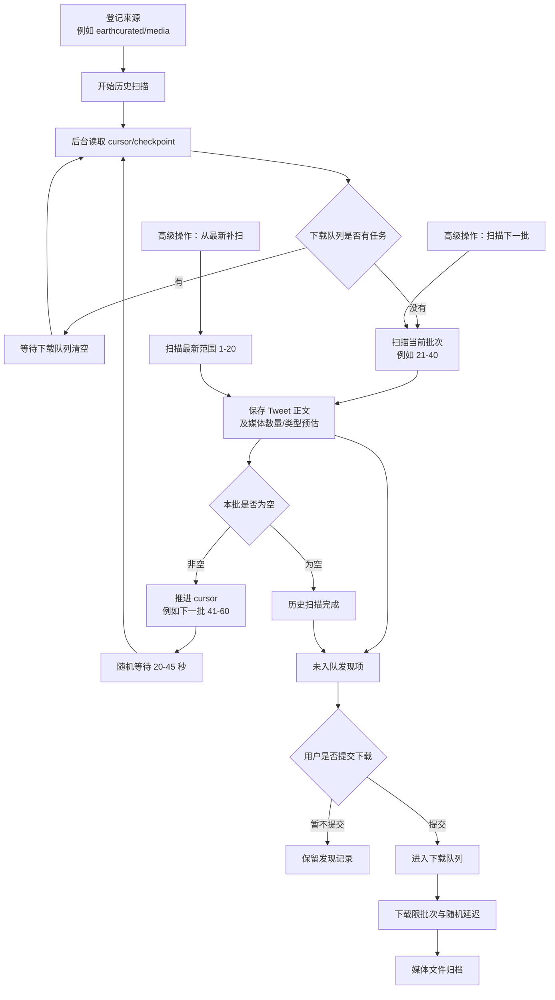

# 来源扫描与下载流程说明

本文说明 Sources 页面中“来源扫描”和“媒体下载”的业务边界，以及日常应如何操作。

## 1. 核心原则

来源例如：

```text
https://x.com/earthcurated/media
```

代表需要持续发现 Tweet 的目标。系统把工作拆为两个独立阶段：

```text
扫描来源 -> 保存发现的 Tweet 与媒体预估信息 -> 人工确认提交 -> 下载队列 -> 下载媒体文件
```

扫描阶段不会自动发起媒体下载。这样可以避免扫描请求和下载请求叠加，降低触发限流的风险。

## 2. 日常推荐流程

对于需要归档的大型博主媒体页，日常只需要关注以下操作：

| 操作 | 业务含义 | 推荐使用时机 |
| --- | --- | --- |
| 开始历史扫描 | 启动后台任务，从保存的原生 cursor 继续向旧内容枚举 | 首次归档或继续长期归档 |
| 暂停扫描 | 保留进度，暂时停止后台枚举 | 临时停止访问或准备下载 |
| 继续历史扫描 | 从暂停时的进度恢复后台枚举 | 继续尚未完成的来源扫描 |
| 提交未入队发现项 | 将已发现的 Tweet 按数量提交至下载队列 | 确认准备开始下载时 |

建议操作路径：

```text
登记来源 -> 开始历史扫描 -> 检查扫描历史/按需暂停 -> 分批提交下载
```

2026-05-27 真实验收发现：仅保存数字 `--range` 会导致深入历史位置后的单批扫描显著
变慢，不能满足大型来源的后台归档目标。系统现已切换为保存并恢复
`gallery-dl` Twitter continuation cursor 的历史扫描方式。当前项目按新项目处理，
不为旧数字 checkpoint 保留兼容流程；需要复验时可以重置数据库后从空库开始。详见
[`source-scanning-acceptance.md`](source-scanning-acceptance.md)。

## 3. Cursor / Checkpoint 的含义

`cursor` 或 `checkpoint` 表示来源枚举已经进行到的位置。系统将
`gallery-dl` Twitter continuation cursor 与调度状态保存在 `archive_sources.cursor_state`
中，因此 API 重启、网络中断或手工暂停后可从下载器原生分页位置继续。

例如每批枚举范围为 20：

```text
第一次扫描：1-20   -> 下一批：21-40
第二次扫描：21-40  -> 下一批：41-60
第三次扫描：41-60  -> 下一批：61-80
```

重要说明：早期数字 `--range` 验收时，媒体页范围对应媒体项，一条 Tweet 可能包含多张
图片或视频。当前历史扫描已切换为 native cursor + `--post-range`，页面中的 `1-20`、
`21-40` 表示 Tweet 批次窗口；每批预估媒体数仍可能大于 Tweet 数。

当 extractor 不再返回下一页 continuation cursor 时，系统才将历史扫描标记为完成。
最后一批可能仍包含 Tweet，因此页面会区分“空批完成”和“末批完成，已到结尾”。

## 4. 高级操作

以下动作收在页面的“高级扫描操作”区域，通常不属于日常主流程：

| 操作 | 业务含义 | 使用场景 |
| --- | --- | --- |
| 扫描下一批 | 只执行当前 cursor 指向的一批扫描，执行后推进 cursor | 调试、确认解析效果或手工验证 |
| 从最新补扫 | 单独从最新范围重新检查一次，不用于替代历史扫描 | 博主后续发布新 Tweet 后补充发现 |
| 停止历史扫描 | 关闭后台自动任务，保留 cursor 与已发现记录 | 不再希望该来源自动运行 |

“从最新补扫”适用于历史归档完成后的增量检查：

```text
历史扫描：持续向过去枚举旧内容
最新补扫：回到最近内容，发现博主后来新增的 Tweet
```

## 5. 后台历史扫描的调度规则

后台 worker 流程为：

1. 读取来源当前的 cursor。
2. 检查下载队列是否存在正在等待或执行的任务。
3. 如果下载队列忙，则延后本轮扫描，避免请求叠加。
4. 如果下载队列空闲，则扫描当前批次并落库发现结果。
5. 随机等待一段时间后继续扫描下一批。
6. extractor 无下一页 cursor 时结束；遇到限流或认证问题则暂停。

每次实际扫描批次，以及因为下载队列仍在工作而跳过的批次尝试，都会写入
`source_scan_runs`。记录中包含扫描范围、触发方式、执行结果、发现/新增/已存在 Tweet 数、
媒体预估数、扫描前后 cursor 和失败摘要。随机等待下一轮的当前调度状态保存在
`archive_sources.cursor_state` 与 `next_scan_at` 中。
如果 API 在一批扫描执行途中停止，下次启动会把遗留的执行中记录标记为中断失败，
页面可以看到该批未正常完成，再由保存的 cursor 继续后续操作。

媒体页的底层枚举是媒体流，不是严格按 Tweet ID 切成互不相交的页。一条包含多张媒体
的 Tweet 可能在相邻 cursor 页里再次出现；系统按 `source_id + tweet_id` 幂等去重，
这类命中计为“已存在”，不会重复提交或重复下载。

默认配置：

```env
SOURCE_SCAN_BATCH_SIZE=20
SOURCE_SCAN_SLEEP_MIN_SECONDS=20
SOURCE_SCAN_SLEEP_MAX_SECONDS=45
```

`SOURCE_SCAN_BATCH_SIZE` 在 native cursor 模式下表示每批目标 Tweet 窗口数量；一条
Tweet 可能产生多个媒体项。这些配置只影响来源发现，不影响媒体下载队列。下载队列
另有独立的 batch 与延迟配置。

## 6. 业务流转图



## 7. 页面指标如何理解

| 页面指标 | 含义 |
| --- | --- |
| 已发现 Tweet | 当前来源已记录的去重 Tweet 数量 |
| 扫描发现媒体 | 扫描元数据中聚合得到的媒体项数量，下载前为预估信息 |
| 未入队发现 | 已发现但尚未提交至下载队列的 Tweet 数量 |
| 下一批范围 | 后台或手工继续扫描时将使用的范围 |
| 历史扫描任务 | 后台任务是否运行、暂停、等待下载队列或已停止 |
| 下次自动扫描 | 下一轮后台扫描计划执行时间 |
| 累计扫描批次 | 实际发起过枚举的批次数；因下载队列忙而等待的事件不计入该数 |
| 累计新增 Tweet | 扫描批次首次发现并写入当前来源的 Tweet 数 |
| 最近成功扫描 / 最近扫描错误 | 用于判断后台停止增长是否源于成功完成或失败 |
| 扫描历史（最近 20 批） | 每批范围、触发方式、结果、统计与错误摘要；API 重启后仍保留 |

扫描发现的媒体数量来自页面元数据。最终归档文件的准确数量和状态，以下载后的
`media_assets` 记录与文件校验结果为准。
