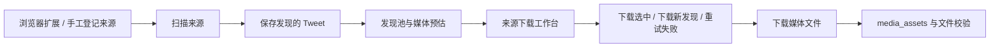
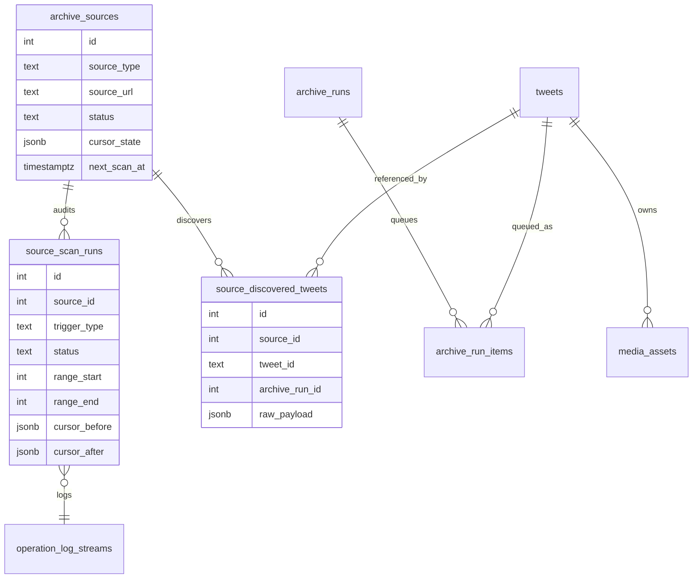
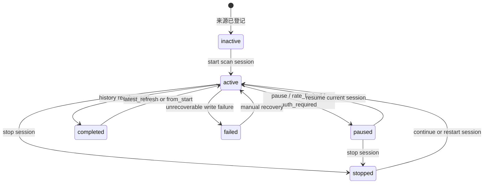
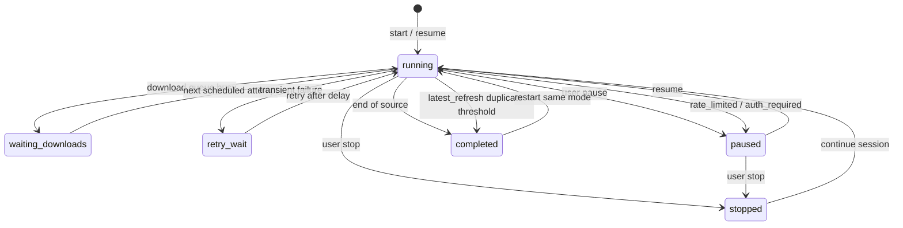
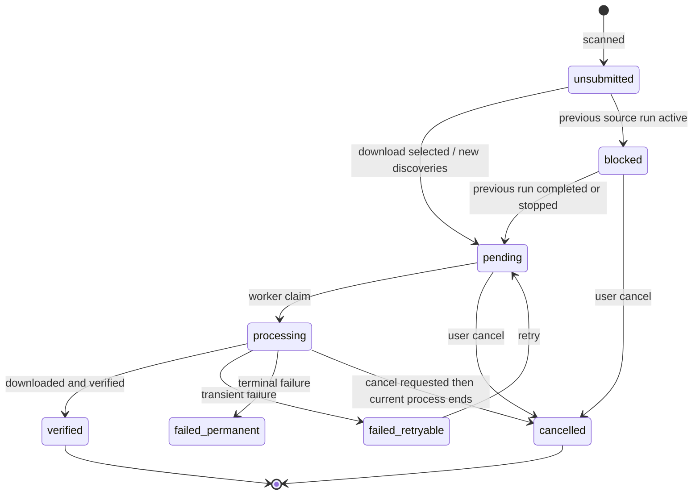
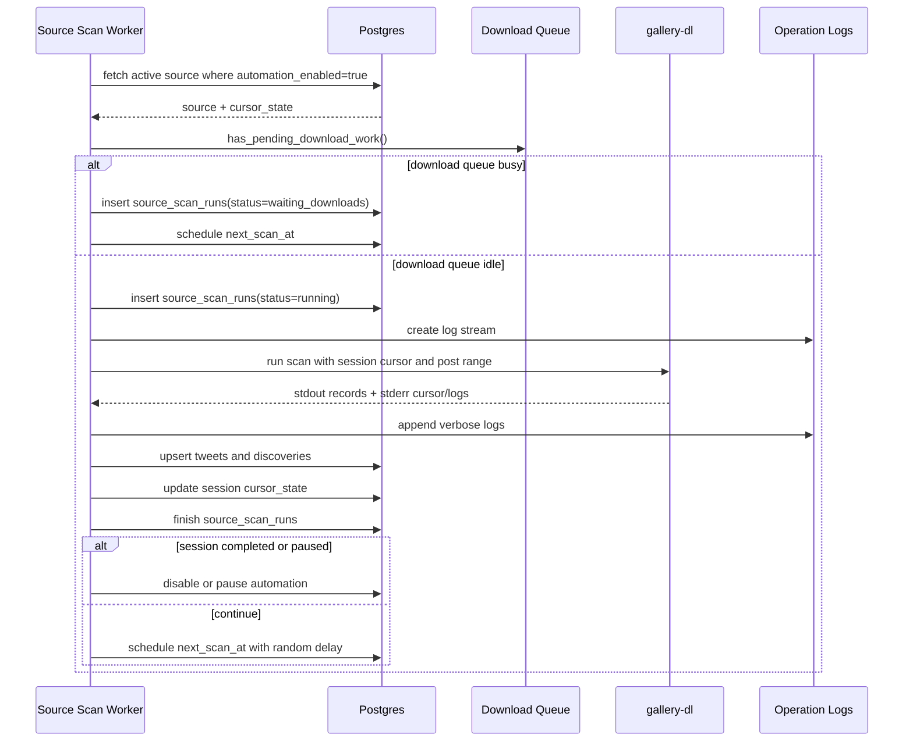

# 来源扫描业务设计与架构需求

本文定义 Sources 页面中“扫描来源”和“来源下载工作台”的业务边界、数据模型、状态机、后台调度与交付验收要求。它是来源扫描与下载整合后的实现依据，也用于后续审查 API、WebUI、worker 与数据库迁移是否保持一致。

## 1. 背景与目标

来源示例：

```text
https://x.com/earthcurated/media
```

一个来源代表需要持续发现 Tweet 的目标。系统把发现和下载拆成两个独立阶段：


```mermaid
flowchart LR
    A["浏览器扩展 / 手工登记来源"] --> B["扫描来源"]
    B --> C["保存发现的 Tweet"]
    C --> D["发现池与媒体预估"]
    D --> E["来源下载工作台"]
    E --> F["下载选中 / 下载新发现 / 重试失败"]
    F --> G["下载媒体文件"]
    G --> H["media_assets 与文件校验"]
```

核心目标：

- 扫描阶段只发现 Tweet 与媒体预估，下载由来源下载工作台显式触发。
- 同一来源同一时间只允许一个扫描会话。
- 历史扫描、补充最新推文、从头扫描/补断层分别持有独立 cursor。
- 扫描、暂停、停止、恢复必须可恢复、可审计。
- 同一来源同一时间只允许一个可运行下载 run；后续来源下载 run 必须进入 blocked。
- WebUI 必须把普通用户操作收敛到“扫描控制、下载工作台、发现列表”三个区域。

非目标：

- 不在扫描子进程内下载真实媒体文件；下载由 archive queue worker 执行。
- WebUI 媒体库与重复媒体页允许按 `media_assets.id` 显式批量删除媒体文件。重复媒体按完整 SHA-256 组分页，可快捷保留建议项并选择其余副本；用户仍可手动调整选择。删除必须经过不可恢复确认、写操作串行化、`archive/media` 路径边界校验和审计；来源发现、Tweet 与下载历史保留，受影响 Tweet 标记为 `missing` 以支持手动重新归档。
- 不把全库扫描、全量校验等维护动作隐式塞入普通扫描请求。
- 不为旧的纯数字 checkpoint 兼容流程新增复杂迁移逻辑。

## 2. 业务边界

扫描业务负责：

- 调用 `gallery-dl` 枚举来源时间线或媒体页。
- 解析 Tweet ID、作者、正文、发布时间和媒体元数据。
- 将发现结果幂等写入 `source_discovered_tweets` 与 `tweets`。
- 更新当前 scan session cursor 和批次审计。
- 记录扫描日志、错误分类、等待下载队列等调度事件。

来源下载业务负责：

- 用户在来源工作台下载选中、新发现或失败项后创建带 `source_id` 的 `archive_runs` / `archive_run_items`。
- 暂停中的来源下载 run 不会自动吞入新扫描结果；新增下载动作创建新的不可变 run。
- 已有 paused/running/queued 来源 run 时，新 run 进入 `blocked`，等待前序 run 完成、停止或失败终止后释放。
- 同一 Tweet 同一时间只能存在一个 active item，重复提交应返回 linked/skipped 统计。
- 下载媒体文件到 `archive/media/<author_id>/<tweet_id>/`。
- 写入 `media_assets`、下载尝试记录、校验状态、item 进度和控制状态。

扫描发现的媒体数量来自页面元数据，是下载前预估。最终媒体数量和状态以下载后的 `media_assets` 与文件校验结果为准。

## 3. 扫描会话模型

Sources 详情页统一使用“扫描来源”面板，不再区分“基础扫描”和“高级扫描”。扫描会话分为三类：

| 会话模式 | active_scan_mode | trigger_type | 业务目标 | 停止规则 | 恢复规则 |
| --- | --- | --- | --- | --- | --- |
| 继续历史扫描 | `history` | `history_worker` | 从保存的历史 cursor 继续向更旧推文扫描 | 用户停止、来源末尾、限流或认证失败 | 从 history session cursor 继续 |
| 补充最新推文 | `latest_refresh` | `latest_refresh` | 从最新时间线补充新发 Tweet | 单批 `duplicate_count > 5`，或来源末尾 | 从 latest_refresh session cursor 继续 |
| 从头扫描/补断层 | `from_start` | `from_start_repair` | 从最新位置重新向旧内容完整扫描，用于修复中间断层 | 用户停止、来源末尾、限流或认证失败 | 从 from_start session cursor 继续 |

补充最新推文的重复阈值按单批统计。如果某一批 `duplicate_count > 5`，系统认为已经补到已知边界并完成该会话。历史扫描和从头扫描遇到重复 Tweet 不停止。

扫描批次大小要求：

- 最小值：5
- 最大值：200
- 默认值：来源上次扫描设置或 `SOURCE_SCAN_BATCH_SIZE`

## 4. 数据模型

### 4.1 核心表


```mermaid
erDiagram
    archive_sources ||--o{ source_scan_runs : audits
    archive_sources ||--o{ source_discovered_tweets : discovers
    tweets ||--o{ source_discovered_tweets : referenced_by
    source_scan_runs }o--|| operation_log_streams : logs
    archive_runs ||--o{ archive_run_items : queues
    tweets ||--o{ archive_run_items : queued_as
    tweets ||--o{ media_assets : owns

    archive_sources {
        int id
        text source_type
        text source_url
        text status
        jsonb cursor_state
        timestamptz next_scan_at
    }

    source_scan_runs {
        int id
        int source_id
        text trigger_type
        text status
        int range_start
        int range_end
        jsonb cursor_before
        jsonb cursor_after
    }

    source_discovered_tweets {
        int id
        int source_id
        text tweet_id
        int archive_run_id
        jsonb raw_payload
    }
```

### 4.2 cursor_state 结构

`archive_sources.cursor_state` 保存调度状态和每个会话的独立 checkpoint：

```json
{
  "active_scan_mode": "history",
  "automation_enabled": true,
  "automation_state": "running",
  "automation_limit": 20,
  "scan_sessions": {
    "history": {
      "mode": "history",
      "state": "running",
      "limit": 20,
      "next_start_index": 41,
      "extractor_cursor": "gallery-dl-continuation",
      "completed": false
    },
    "latest_refresh": {
      "mode": "latest_refresh",
      "state": "completed",
      "limit": 20,
      "next_start_index": 21,
      "completed": true
    },
    "from_start": {
      "mode": "from_start",
      "state": "paused",
      "limit": 20,
      "next_start_index": 61,
      "extractor_cursor": "gallery-dl-continuation",
      "completed": false
    }
  }
}
```

兼容要求：

- 顶层 `next_start_index` 和 `extractor_cursor` 只代表历史扫描兼容字段。
- `latest_refresh` 和 `from_start` 的进度不得覆盖历史扫描 cursor。
- WebUI 展示下一批范围时应优先读取当前 active session。
- `source_scan_runs.cursor_before` 和 `cursor_after` 应保留当批执行前后的可审计快照。

## 5. 状态机

### 5.1 来源级状态


```mermaid
stateDiagram-v2
    [*] --> inactive: 来源已登记
    inactive --> active: start scan session
    active --> paused: pause / rate_limited / auth_required
    paused --> active: resume current session
    active --> stopped: stop session
    paused --> stopped: stop session
    stopped --> active: continue or restart session
    active --> completed: history reaches end
    completed --> active: latest_refresh or from_start
    active --> failed: unrecoverable write failure
    failed --> active: manual recovery
```

来源表的 `status` 只描述对用户可见的总体状态。具体扫描会话状态由 `cursor_state.automation_state` 与 `scan_sessions[active_scan_mode].state` 描述。

### 5.2 会话级状态


```mermaid
stateDiagram-v2
    [*] --> running: start / resume
    running --> waiting_downloads: download queue busy
    waiting_downloads --> running: next scheduled attempt
    running --> retry_wait: transient failure
    retry_wait --> running: retry after delay
    running --> paused: user pause
    running --> paused: rate_limited / auth_required
    paused --> running: resume
    running --> stopped: user stop
    paused --> stopped: user stop
    stopped --> running: continue session
    running --> completed: end of source
    running --> completed: latest_refresh duplicate threshold
    completed --> running: restart same mode
```

暂停和停止都不会强制终止已经启动的 `gallery-dl` 子进程。当前批次会自然结束并写入审计记录，worker 在下一轮调度前重新读取来源状态。如果来源已暂停或自动任务已停止，则不会继续发起下一批。

### 5.3 来源下载状态


```mermaid
stateDiagram-v2
    [*] --> unsubmitted: scanned
    unsubmitted --> pending: download selected / new discoveries
    unsubmitted --> blocked: previous source run active
    blocked --> pending: previous run completed or stopped
    pending --> processing: worker claim
    processing --> verified: downloaded and verified
    processing --> failed_retryable: transient failure
    processing --> failed_permanent: terminal failure
    pending --> cancelled: user cancel
    blocked --> cancelled: user cancel
    processing --> cancelled: cancel requested then current process ends
    failed_retryable --> pending: retry
    verified --> [*]
    cancelled --> [*]
```

下载 run 的成员不可变。暂停后新扫描到的 Tweet 只进入发现池；恢复下载只恢复暂停 run，不会自动包含新发现。再次点击“下载新发现”或“下载选中”会创建新的 run。若前序来源 run 仍处于 `queued`、`running` 或 `paused`，新 run 必须进入 `blocked`。

## 6. 后台调度设计


```mermaid
sequenceDiagram
    participant W as Source Scan Worker
    participant DB as Postgres
    participant Q as Download Queue
    participant G as gallery-dl
    participant L as Operation Logs

    W->>DB: fetch active source where automation_enabled=true
    DB-->>W: source + cursor_state
    W->>Q: has_pending_download_work()
    alt download queue busy
        W->>DB: insert source_scan_runs(status=waiting_downloads)
        W->>DB: schedule next_scan_at
    else download queue idle
        W->>DB: insert source_scan_runs(status=running)
        W->>L: create log stream
        W->>G: run scan with session cursor and post range
        G-->>W: stdout records + stderr cursor/logs
        W->>L: append verbose logs
        W->>DB: upsert tweets and discoveries
        W->>DB: update session cursor_state
        W->>DB: finish source_scan_runs
        alt session completed or paused
            W->>DB: disable or pause automation
        else continue
            W->>DB: schedule next_scan_at with random delay
        end
    end
```

调度规则：

1. 读取当前 active scan session。
2. 依据 session mode 映射 `trigger_type`。
3. 依据 active session cursor 计算当前批次窗口，例如 `1-20`、`21-40`。
4. 检查下载队列是否存在 pending 或 processing 任务。
5. 下载队列忙时写入 `waiting_downloads` 审计记录并延后扫描。
6. 下载队列空闲时调用 `gallery-dl`。
7. 子进程完整返回后解析、去重、落库。
8. 按 session 规则决定继续、暂停、停止或完成。
9. 未完成时根据 `SOURCE_SCAN_SLEEP_MIN_SECONDS` 和 `SOURCE_SCAN_SLEEP_MAX_SECONDS` 随机延后下一批。

运行中的批次会把 `gallery-dl --verbose` 日志写入 `archive/logs/source-scan-logs/` 下的 JSONL 文件。数据库保存日志流索引和摘要。Sources 详情页通过“查看最新扫描日志”打开弹层，`Operations -> Logs` 可查看同一日志流。

## 7. WebUI 交互需求

### 7.1 页面状态与按钮

| 页面状态 | 主按钮 | 说明 |
| --- | --- | --- |
| 无数据、无会话 | 开始扫描 | 启动 history session |
| 运行中 | 暂停、停止、查看最新扫描日志 | 不展示其他扫描入口 |
| 已暂停 | 恢复当前会话、停止 | 恢复按钮显示当前会话语义 |
| 已停止 | 继续上次会话，并展示合理分叉 | 例如继续补最新、继续历史扫描 |
| 历史扫描完成 | 补充最新推文、从头扫描/补断层 | 从头扫描属于修复入口 |
| 补最新完成 | 再次补充最新推文 | 表示已补到已知记录 |

### 7.2 展示指标

| 指标 | 含义 |
| --- | --- |
| 已发现 Tweet | 当前来源已记录的去重 Tweet 数量 |
| 扫描发现媒体 | 扫描元数据聚合得到的媒体项数量，下载前为预估 |
| 未入队发现 | 已发现但尚未提交至下载队列的 Tweet 数量 |
| 下一批范围 | 当前 active session 将使用的 Tweet 窗口 |
| 扫描状态 | 当前 active session 是否可继续、已完成或进入重复区 |
| 历史扫描任务 | 当前会话模式和后台调度状态 |
| 下次自动扫描 | 下一轮后台扫描计划执行时间 |
| 累计扫描批次 | 实际发起过枚举的批次数，`waiting_downloads` 不计入 |
| 累计新增 Tweet | 扫描批次首次发现并写入当前来源的 Tweet 数 |
| 最近成功扫描 / 最近扫描错误 | 用于判断后台停止增长的原因 |

### 7.3 下载工作台交互

| 场景 | 系统行为 | 用户可见结果 |
| --- | --- | --- |
| 暂停下载后继续扫描 | 新 Tweet 只进入发现池 | 旧 run 仍显示暂停，新发现显示未入队 |
| 继续下载 | 只恢复暂停 run | 不自动包含暂停后新发现 |
| 下载新发现 | 创建新的来源 run | 若旧 run 暂停，新 run 显示等待前序任务 |
| 下载选中 | 只提交选中且未 active/未完成 Tweet | 已有任务和已归档项被跳过 |
| 取消选中 | pending/blocked 变 `cancelled`，processing 标记取消请求 | 当前子进程自然结束 |
| 停止下载 | 取消未开始 item，processing 自然结束 | 后续 blocked run 可被释放 |

### 7.4 交互约束

- 运行中只允许暂停、停止、查看日志，不展示新的扫描入口。
- 暂停后允许恢复当前会话或停止当前会话。
- 停止后保留 cursor，允许继续当前会话，也允许按业务规则启动分叉会话。
- 下载工作台必须独立于扫描控制，避免把“暂停扫描”和“暂停下载”混为一个动作。
- 发现列表只允许页内选择；跨页批量下载必须使用“下载新发现”入口。
- 用户触发下载提交时必须明确知道这是下载队列动作，不是继续扫描动作。

## 8. API 需求

| Endpoint | 用途 | 返回 |
| --- | --- | --- |
| `POST /api/v1/sources/{source_id}/scan-sessions` | 启动或继续指定扫描会话 | `ArchiveSourceDetailResponse` |
| `POST /api/v1/sources/{source_id}/scan-sessions/pause` | 暂停当前扫描会话 | `ArchiveSourceDetailResponse` |
| `POST /api/v1/sources/{source_id}/scan-sessions/resume` | 恢复当前扫描会话 | `ArchiveSourceDetailResponse` |
| `POST /api/v1/sources/{source_id}/scan-sessions/stop` | 停止当前扫描会话 | `ArchiveSourceDetailResponse` |
| `GET /api/v1/sources/{source_id}` | 获取来源详情、汇总、active run | `ArchiveSourceDetailResponse` |
| `GET /api/v1/sources/{source_id}/scan-runs` | 分页查看扫描批次审计 | `SourceScanRunsPageResponse` |
| `GET /api/v1/log-streams/{stream_id}` | 查看扫描日志 | `OperationLogEntriesResponse` |
| `GET /api/v1/sources/{source_id}/downloads` | 查看来源下载工作台汇总、active/paused/blocked runs | `SourceDownloadSummaryResponse` |
| `POST /api/v1/sources/{source_id}/downloads` | 下载选中、新发现或失败项 | `ArchiveSubmissionResponse` |
| `POST /api/v1/sources/{source_id}/submit-discovered` | 兼容旧入口，等价于提交未入队发现项 | `ArchiveSubmissionResponse` |
| `POST /api/v1/archive-runs/{run_id}/pause` | 暂停下载 run，不强杀当前子进程 | `ArchiveRunControlResponse` |
| `POST /api/v1/archive-runs/{run_id}/resume` | 恢复暂停下载 run | `ArchiveRunControlResponse` |
| `POST /api/v1/archive-runs/{run_id}/stop` | 停止下载 run，取消未开始 item | `ArchiveRunControlResponse` |
| `POST /api/v1/archive-runs/{run_id}/items/cancel` | 取消 pending/blocked item，processing item 仅标记取消请求 | `ArchiveRunControlResponse` |

接口约束：

- 状态切换接口必须返回完整 `ArchiveSourceDetailResponse`，不能返回基础 source row。
- 新增或调整 API schema 后必须同步 `webui/src/api/generated.ts`。
- 写操作必须保持 API 进程内锁语义或显式更新并发策略。
- 所有错误响应不得暴露 cookie、生产连接串或其他凭据。
- 下载提交必须按 Tweet 加锁并保持幂等，不能为同一 Tweet 创建多个 active item。
- 同一来源只能有一个 runnable 下载 run；后续来源 run 使用 `blocked` 等待释放。

## 9. 错误处理与恢复

| 场景 | 系统行为 | 用户可见结果 |
| --- | --- | --- |
| 下载队列忙 | 写入 `waiting_downloads` 批次记录，延后扫描 | 扫描状态显示等待下载队列清空 |
| `gallery-dl` 限流 | 当前会话暂停，记录 `rate_limited` | 用户可恢复或停止 |
| 认证失败 | 当前会话暂停，记录 `auth_required` | 用户更新 cookie 后恢复 |
| 网络或临时失败 | 记录错误，按 retry wait 调度 | 用户可查看批次错误和日志 |
| API 中途停止 | 启动恢复逻辑标记遗留 running scan 为 interrupted | 后续可从已保存 cursor 继续 |
| 用户暂停 | 当前批次自然结束，下一轮不再调度 | 页面显示已收到暂停状态 |
| 用户停止 | 关闭 automation，保留 session cursor | 页面展示继续或分叉入口 |
| 下载 run 暂停 | 不再 claim 后续 item，processing 自然结束 | 下载工作台显示暂停，可继续或停止 |
| 下载 run 停止 | pending/blocked/failed_retryable 变 cancelled，processing 标记取消请求 | 下载工作台显示已停止，后续 blocked run 释放 |
| 重复点击下载 | 事务锁和唯一 active item 约束阻止重复 item | 返回已有任务和已归档统计 |
| 同一来源已有 active run | 新来源 run 进入 blocked | 页面显示等待前序任务 |

扫描网络请求默认使用 `SOURCE_SCAN_HTTP_TIMEOUT_SECONDS=15` 和
`SOURCE_SCAN_HTTP_RETRIES=2`。gallery-dl 可能在 HTTP 重试耗尽后仍返回退出码 0；
worker 会额外识别末次重试错误，将整批标记为 `network_error`，不保存不完整输出，
也不推进 continuation cursor。

## 10. 验收要求

后端验收：

- `history`、`latest_refresh`、`from_start` 各自独立保存 cursor。
- `latest_refresh` 只有在单批 `duplicate_count > 5` 或来源末尾时完成。
- `from_start` 遇到重复 Tweet 不提前完成。
- `waiting_downloads` 和扫描失败审计必须使用 active session 的范围。
- 暂停、恢复、停止接口必须通过 FastAPI response model 校验。
- 新增 `trigger_type` 必须有 Alembic revision 更新数据库约束。

前端验收：

- Sources 详情页只有一个“扫描来源”入口。
- Sources 详情页必须包含独立下载工作台，显示 active/paused/blocked run、速度、大小和进度摘要。
- 发现列表支持页内勾选、下载选中、下载新发现、重试失败、行级下载和取消。
- 暂停下载后继续扫描，新发现不能自动加入旧 run。
- 有 paused/running/queued 来源 run 时再次下载新发现，新 run 必须显示 blocked。
- 运行中不展示其他扫描入口。
- 暂停后恢复按钮显示当前会话语义。
- 补最新完成时显示“补充最新推文已完成”，不能误显示“历史扫描已完成”。
- 下一批范围优先读取 active session。
- 日志弹层和 `Operations -> Logs` 能打开同一日志流。

建议验证命令：

```bash
docker-compose run --rm --entrypoint python xarchiver -m unittest discover -s /app/tests
cd webui && npm run build
```

轻量改动可至少运行：

```bash
git diff --check
docker-compose run --rm --entrypoint python xarchiver -m unittest tests.test_queue_integration tests.test_sources tests.test_api_v1_routes
cd webui && npm run typecheck
```
